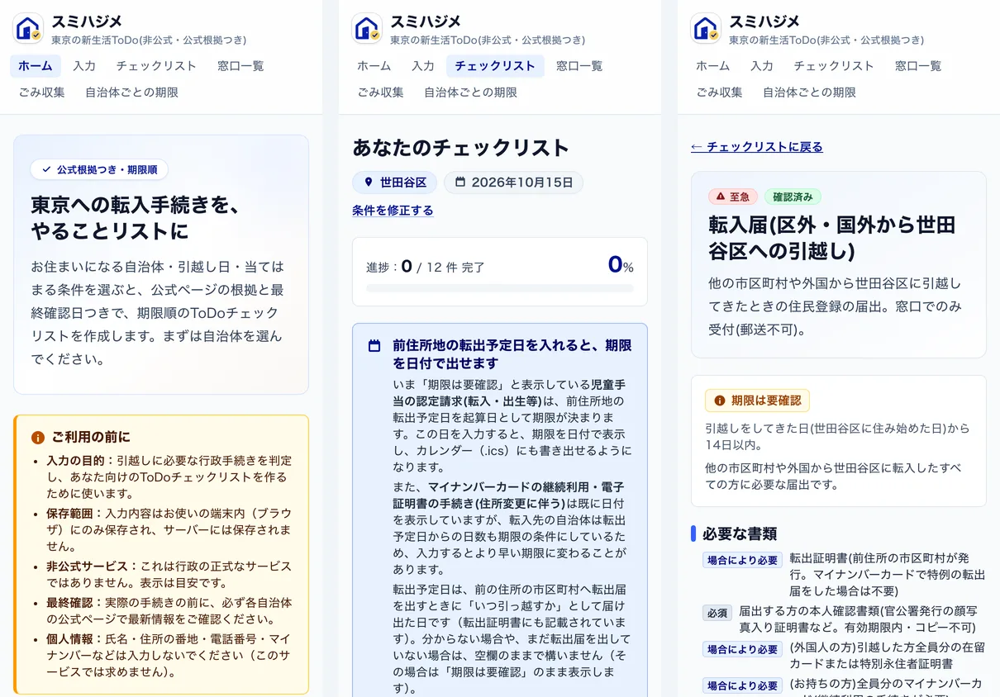
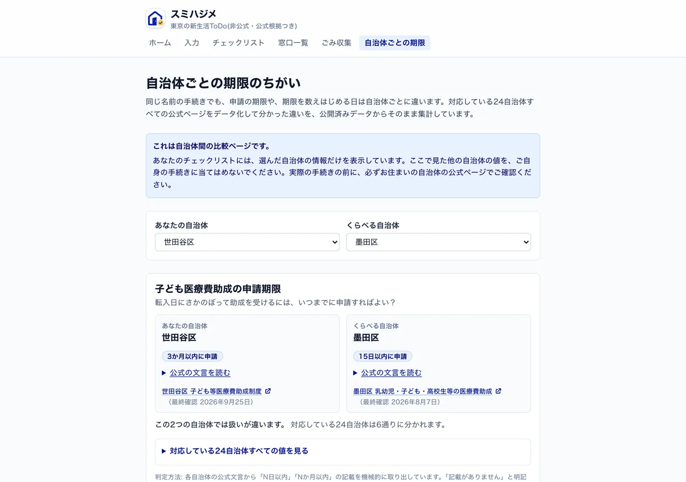
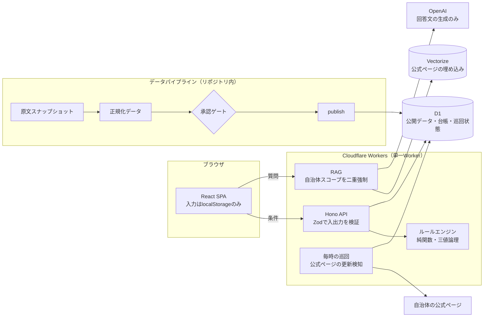

# スミハジメ 〜東京の新生活ToDo〜

東京へ引っ越す人が、**転入先・引越し日・世帯の条件**を選ぶだけで、必要な行政手続きを
**期限順のToDo**にまとめるWebサービスです。すべてのタスクに、**自治体の公式ページと最終確認日**が付きます。

**https://app.sumihajime.workers.dev** （非公式サービス。登録・ログイン不要）



> A web service that turns "I'm moving to Tokyo" into a deadline-ordered to-do list of the
> municipal procedures you actually need. Every task cites an approved official page with its
> last-verified date; eligibility is decided by a deterministic rules engine, never by an LLM.

## 何を解決するか

引越しの手続きは、住民票・マイナンバーカード・国民健康保険・児童手当・保育・犬の登録……と自治体ごとに
ページが分かれ、**期限も自治体によって違います**（子ども医療費助成の申請期限は、対応している
24自治体だけで6通りに分かれます）。スミハジメは、選んだ自治体の公式情報だけを使って
「自分に必要な手続き」と「いつまでに」を1画面に並べます。

- **対応範囲**: 東京都の62市区町村のうち **24自治体**（23区＋八王子市）。未対応の自治体は「未対応」と明示し、
  公式サイトへの導線だけを出します（対応済みに見せない）。
- **公式根拠**: 承認済みの公式ソース **358件**。どのタスクにも出典URLと最終確認日が付きます。
- **期限の計算**: 引越し日（と転出予定日）から、自治体ごとの起算日・日数で期限を計算します。
  日数が公式ページに書かれていない手続きは、推測で埋めず「期限は要確認」と表示します。
- **AIチャット（補助）**: 選んだ自治体の公式ページだけを根拠に答え、根拠がなければ答えずに公式ページへ案内します。



## 設計の原則

| 原則                           | 実装                                                                                                                                                                              |
| ------------------------------ | --------------------------------------------------------------------------------------------------------------------------------------------------------------------------------- |
| 該当判定をLLMに任せない        | 手続きの該当・期限は純関数のルールエンジン（`packages/rules`）で決める。三値論理（該当／非該当／不明）で、不明は不明のまま出す                                                    |
| すべての公開タスクに公式根拠   | 公開は人が承認したソースに紐づくデータだけ（[ADR-007](docs/adr/ADR-007-publish-unit-verified-only.md)）。承認前のデータは公開パイプラインのゲートで止まる                         |
| 古くなった根拠を黙って出さない | 公式ページを毎時巡回し、更新を検知した手続きを自動で「再確認中」に落とす。解除できるのは人の再監査だけ（[ADR-014](docs/adr/ADR-014-scheduled-drift-check-and-auto-downgrade.md)） |
| 自治体の情報を混ぜない         | 検索・チャット・画面のすべてで自治体コードを二重に強制。比較は専用の比較ページでだけ行う                                                                                          |
| 個人情報を集めない・残さない   | 氏名・連絡先・生年月日・完全な住所は入力させない。入力はブラウザ内にだけ保存し、ログは許可リスト方式（`apps/api/src/log.ts`）                                                     |
| 障害時もチェックリストは使える | チャットやAPIが落ちても、端末内の控えとチェックリスト・公式リンクは残る（[ADR-012](docs/adr/ADR-012-offline-checklist-copy-and-failure-isolation.md)）                            |

## アーキテクチャ



- **データの流れ**: 公式ページの原文を保存 → 手続き単位に正規化 → スキーマ検証 → **人が承認** → 公開。
  取得原文・正規化データ・公開データを分け、出典・ライセンス・最終確認日を台帳
  （[`docs/data-sources/registry.csv`](docs/data-sources/registry.csv)）の1行で追跡します。
- **鮮度の維持**: Cron が毎時10ソースずつ公式ページを再取得し、ページ自身の「更新日」の変化を検知します。
  検知した手続きは画面で「再確認中」になり、人が差分を読んで再承認するまで戻りません
  （手順: [`docs/ops/reaudit.md`](docs/ops/reaudit.md)）。
- **外形監視**: `/api/health` が DB・公開件数・巡回の停止を自己診断し、外部の監視が15分ごとに確認します
  （[`docs/ops/monitoring.md`](docs/ops/monitoring.md)）。

## 品質の根拠（2026-09-29 時点）

| 観点                   | 結果                                                                                                                                                               |
| ---------------------- | ------------------------------------------------------------------------------------------------------------------------------------------------------------------ |
| 単体・統合テスト       | **2,590件**（ルールエンジン 1,416件を含む。Vitest）                                                                                                                |
| E2E                    | **87件**（Playwright。モバイル幅が主線。キーボード操作・タップ標的24px・CSP違反ゼロを含む）                                                                        |
| アクセシビリティ       | axe-core で全11画面 × モバイル/デスクトップの違反 **0件**。Lighthouse アクセシビリティ **100**                                                                     |
| 性能（本番・モバイル） | Lighthouse 性能 **94〜96**、初回表示 約2秒、レイアウトのずれ（CLS）**0**（[ADR-015](docs/adr/ADR-015-system-fonts-and-route-splitting.md)）                        |
| AIチャットの評価       | 186問を本番で評価。根拠のない断定 **0**・自治体混入 **0**・出典の自治体一致 **100%**。応答の p95 は 2.5 秒（[評価レポート](docs/research/rag-eval-2026-09-29.md)） |
| データの正確性         | 無作為抽出した25件（278項目）を公式ページと突き合わせ、見つかった誤り（閉所した出張所など）をすべて修正・再承認                                                    |
| セキュリティ           | CSP（`unsafe-*` なし）・HSTS・COOP/CORP、入力サイズ上限、チャットの1日上限、回答中の非公式URLはリンクにしない                                                      |

## 技術スタック

- **フロントエンド**: React 18 + Vite（画面ごとのコード分割）、Tailwind CSS、React Router、MapLibre GL（地理院タイル）
- **API**: Hono on Cloudflare Workers（静的アセットと同じ1つのWorker）、Zod
- **データ**: Cloudflare D1（SQLite）、Vectorize、Cron Triggers
- **AI**: OpenAI（埋め込みと回答文の生成のみ。判定には使わない）
- **品質**: TypeScript strict（`noUncheckedIndexedAccess`）、Vitest、Testing Library、Playwright、axe-core、ESLint、Prettier
- pnpm monorepo

## リポジトリ構成

```text
apps/
  web/            React SPA
  api/            Hono Worker（API・静的アセット配信・毎時の巡回）
packages/
  schemas/        Zod スキーマ・API 契約（単一の定義）
  rules/          ルールエンジン（純関数）と期限計算
  rag/            検索・プロンプト・回答検証
  drift/          公式ページの更新検知
  domain/         Web と API で共有する定数（ルート・公式ホスト・日付）
data/
  sources/        取得原文のスナップショット（監査の証跡）
  normalized/     手続き単位に正規化したデータ
  evaluations/    AIチャットの評価データセット
scripts/          取得・検証・再監査・公開・索引構築・評価
docs/             ADR・運用手順・ソース台帳・調査記録
tests/e2e/        Playwright + axe-core
```

## 開発

前提: Node.js 22 以上、pnpm 10 以上（`corepack enable`）。

```sh
pnpm install
pnpm typecheck      # 全パッケージの型チェック
pnpm test           # 単体・統合テスト（E2E を除く）
pnpm lint
pnpm format:check
pnpm test:e2e       # E2E（初回のみ: pnpm --filter @tmn/e2e exec playwright install chromium）
```

E2E は `wrangler dev --local`（ポート8788）に、ローカルD1へシードしたデータとビルド済みSPAを載せて実行します
（`tests/e2e/playwright.config.ts` が自動で起動・終了します）。チャットはモックし、外部APIは呼びません。

`pnpm format`（リポジトリ全体の整形）は使わないでください。`data/sources/` の原文スナップショットは
SHA-256 を台帳に記録しており、整形するとハッシュが変わります。変更したファイルだけを整形します。

## ドキュメント

- 要件: [`REQUIREMENTS.md`](REQUIREMENTS.md) ／ 実装計画: [`docs/IMPLEMENTATION_PLAN.md`](docs/IMPLEMENTATION_PLAN.md) ／ ロードマップ: [`docs/ROADMAP.md`](docs/ROADMAP.md)
- 設計判断の記録: [`docs/adr/`](docs/adr/)
- 運用: [巡回](docs/ops/drift-check.md)・[再監査](docs/ops/reaudit.md)・[外形監視](docs/ops/monitoring.md)
- データの監査記録: [`docs/research/`](docs/research/)

## ライセンス

- **ソースコード**: MIT（[`LICENSE`](LICENSE)）
- **データ**: 出典元の利用条件に従います（[`LICENSE-DATA.md`](LICENSE-DATA.md)）。手続きの本文は転載せず、
  要約・出典リンク・最終確認日で扱います。オープンデータの帰属表示はサービス内の
  「このサービスのデータについて」に掲載しています。

本サービスは行政の公式サービスではありません。実際の手続きの前に、必ず各自治体の公式ページで最新情報をご確認ください。
