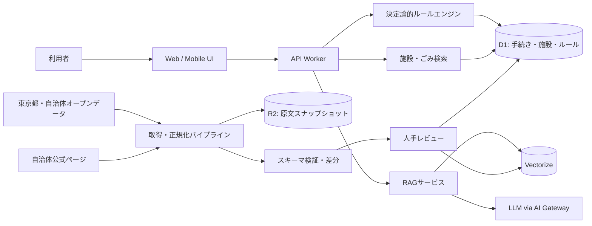

# スミハジメ 〜東京の新生活ToDo〜 要件定義書

- 文書バージョン: 0.1.1
- 作成日: 2026-07-20
- ステータス: 初期実装計画（Claude Code Plan）作成用ベースライン
- 対象イベント: 都知事杯オープンデータ・ハッカソン2026
- サービス案:
  **東京転入者向け、都内横断で必要手続き・生活情報を住所・世帯別に公式根拠付きでToDo化するサービス**

> 本書は「何を、なぜ作るか」を定義する。詳細なタスク分解、実装順序、工数、最終的な技術選定は、本書を入力として Claude Code の Plan で決定する。

---

## 1. エグゼクティブサマリー

東京都へ転入する人は、転入届、マイナンバー、健康保険、年金、子育て、ごみ、窓口、オンライン申請などの情報を、東京都・区市町村・国・関連事業者の複数ページから探す必要がある。情報は文章中心で、自治体や世帯条件によって異なるため、「自分に必要な手続きが何か」「いつまでに、何を持って、どこで行うか」「見落としがないか」を判断しにくい。

本サービスは、転入先と引越し日、世帯構成などの最低限の条件を段階的に入力すると、利用者に該当する行政手続き・生活情報を、期限順の個別チェックリストとして生成する。各項目には、該当理由、期限、必要書類、手続き方法、窓口、公式情報へのリンク、最終確認日を付ける。

不明点は、審査済みの自治体公式情報のみを参照する RAG チャットで補足する。ただし、チェックリストの適用判定は LLM ではなく、構造化データと決定論的ルールで行う。根拠が取れない場合、チャットは断定せず、公式窓口への確認を案内する。

ハッカソン時点の MVP は東京都全域を名目だけで薄く対応するのではなく、データ品質を確認できる3自治体程度を深く対応する。共通スキーマと追加手順を整備し、将来は都内62区市町村へ拡張できる設計とする。

---

## 2. 背景と解決すべき課題

### 2.1 背景

- 引越し直後は時間的・心理的余裕が少なく、行政手続きと生活立ち上げを並行して行う必要がある。
- 手続き情報は自治体ごとに構成・表現・更新方法が異なる。
- 同じ自治体でも、世帯構成、子どもの年齢、加入保険、転入元、外国籍、介護・障害、ペット等によって該当手続きが変わる。
- 公式サイトの検索結果やリンク集だけでは、利用者自身が適用条件を読み解く必要がある。
- 生成AIによる自由回答だけでは、誤案内や自治体の取り違えが実害につながる。

### 2.2 課題定義

東京への転入者が、複数の公式サイトを探し回り、自分に必要な手続きと生活情報を自力で選別しなければならない。その結果、以下が生じる。

1. 必要手続きの見落とし
2. 期限超過や再訪問
3. 必要書類不足による手戻り
4. 窓口・オンライン可否の確認負担
5. ごみ出し等、生活開始後に必要な地域ルールの把握遅れ
6. 公式情報かどうか判断する負担

### 2.3 根本原因

- 情報の所在が分散している
- 情報が利用者の行動単位ではなく、行政組織・制度単位で提供されている
- 自治体間でデータ構造が統一されていない
- 条件分岐が文章の中に埋もれている
- 更新日・根拠・適用範囲が一覧で比較できない

---

## 3. サービスの目的と価値

### 3.1 プロダクトビジョン

**東京に来た人が、初日から「次に何をすべきか」で迷わない状態をつくる。**

### 3.2 ユーザー価値

- 最低限の入力から、自分に必要な項目だけを確認できる
- 「いつまでに・何を・どこで・どう行うか」が分かる
- 公式根拠と最終確認日をその場で確認できる
- 進捗をチェックできる
- 個別の疑問を、自治体を取り違えない根拠付きチャットで確認できる

### 3.3 東京都・自治体側の価値

- 公式情報への適切な導線を増やす
- 転入者の問い合わせ・再訪問・手戻りの削減可能性を示す
- 自治体ごとに分散したデータの共通スキーマ化・再利用可能性を示す
- オープンデータの利用実績と不足データを可視化する

### 3.4 提供しない価値

本サービスは行政機関による法的判断、正式な申請受理、個別事情に対する確定回答を代替しない。最終判断が必要な事項は、公式ページまたは担当窓口へ誘導する。

---

## 4. 都知事杯との整合

2026年度の審査基準は、データ活用、アイデア力、技術力、ソーシャルインパクト、サービスデザインの5項目である。本サービスは次のように対応する。

| 審査基準             | 本サービスで示す内容                                                                             |
| -------------------- | ------------------------------------------------------------------------------------------------ |
| データ活用           | 東京都・区市町村オープンデータ、自治体公式ページ、施設・ごみ等の構造化データを共通スキーマへ統合 |
| アイデア力           | 情報検索ではなく、住所・世帯条件から実行可能な個別ToDoへ変換                                     |
| 技術力               | 決定論的ルール、データ来歴管理、差分検知、自治体スコープ付きRAG、評価基盤                        |
| ソーシャルインパクト | 探索時間、見落とし、再訪問を減らし、転入者の手取り時間を増やす                                   |
| サービスデザイン     | 最低限入力、段階的質問、期限順チェックリスト、公式根拠、モバイル・アクセシビリティ               |

### 4.1 2026年度の開発上の期限

公式サイト上の予定（2026-07-20確認時点）は以下。変更時は公式情報を優先する。

- エントリー締切: 2026-07-27 17:00
- 作品提出期間: 2026-07-10〜2026-08-23
- First Stage収録: 2026-08-26〜2026-08-30（2分プレゼン）
- Final Stage: 2026-10-17

したがって、8月23日時点では「広い未完成機能」より、3自治体程度で信頼できる縦切りデモを完成させる。

---

## 5. スコープ

### 5.1 MVP（P0 / Must）

1. 対応自治体を3自治体程度に限定し、対応状況を明示する
2. 転入先、引越し日、転入元区分、世帯構成、主要条件を段階的に入力できる
3. 条件に応じた転入ToDoチェックリストを生成する
4. 各ToDoに以下を表示する
   - タイトル
   - 該当理由
   - 優先度
   - 期限または期限算定根拠
   - 必要書類
   - 手続き方法（窓口、オンライン、郵送等）
   - 手続き場所
   - 公式情報URL
   - 最終確認日
5. タスク完了状態を端末内に保存する
6. 公式施設データを用いた窓口一覧または地図を表示する
7. 対応自治体で利用可能な場合、ごみ収集日・分別導線を表示する
8. 審査済み公式情報を参照する限定的なRAGチャットを提供する
9. RAG回答に出典と最終確認日を付け、根拠がない場合は回答を保留する
10. データソース、ライセンス、更新状況を確認できる
11. スマートフォンで主要導線を完結できる
12. 主要な自動テストと受入テストを通過する

### 5.2 P1（Should）

- 町丁目・郵便番号によるごみ地区の自動解決
- カレンダー表示、期限通知、ICS出力
- チェックリストの匿名共有URLまたはPDF出力
- やさしい日本語
- 英語表示
- 混雑情報・開庁時間の表示
- 公式ページの変更差分検知と管理者レビュー画面
- 利用者フィードバック
- 対応自治体の追加を半自動化するインポートワークフロー

### 5.3 P2（Could / Final Stage以降）

- 都内62区市町村への拡張
- 電気、ガス、水道、通信、郵便等の民間・国サービス連携
  - **一部を前倒しで実装（2026-08-06、ユーザー決裁 2026-08-02）**: 水道（下水道を含む）・郵便の転居届・電気ガスの住所変更連絡・運転免許証の記載事項変更の4手続きを、対応7区のチェックリストへ追加した。電気・ガスは中立性のため特定事業者を名指しせず、国（デジタル庁）の公式ページのみを根拠とする。通信（インターネット・携帯電話）は前倒しの対象外でP2のまま。詳細と設計判断は `docs/adr/ADR-009-non-municipal-procedures-and-neutrality.md`。人手レビュー承認までは公開しない（出典 review_status=pending / 手続き dataStatus=partial。ADR-007）。
- マイナポータル等への申請導線の高度化
- 保育園、学校、福祉等の詳細条件分岐
- プッシュ通知
- アカウント同期
- 外部カレンダー連携
- 自治体向けデータ更新ダッシュボード
- 自治体が自ら情報を更新できる編集・承認フロー

### 5.4 MVPで行わないこと

- 全自治体を「対応済み」と見せること
- 行政申請の代理送信
- 利用者の本人確認
- 氏名、電話番号、メール、完全な生年月日を必須入力にすること
- LLMだけで手続きの該当可否を判断すること
- 根拠がない手続きを推測して表示すること
- 非公式まとめサイトを一次根拠として使用すること
- 外部サイトをユーザーの質問ごとに無制限クロールすること

---

## 6. 対象ユーザーと代表シナリオ

### 6.1 プライマリーペルソナA: 単身会社員

- 都外から東京へ転入
- 平日に役所へ行ける時間が少ない
- 会社の健康保険に加入
- マイナンバーカードあり
- 欲しい情報: 転入届、住所変更、窓口、オンライン可否、ごみ曜日

### 6.2 プライマリーペルソナB: 子育て世帯

- 夫婦と未就学児または小学生
- 児童手当、医療助成、保育・学校関連が気になる
- 手続き数が多く見落とし不安が大きい
- 欲しい情報: 世帯全体の期限順ToDo、子ども関連の追加手続き、必要書類

### 6.3 セカンダリーペルソナC: 海外・外国籍の転入者

- 日本語情報の読み解きに負担がある
- 在留関連と自治体手続きを区別したい
- MVPでは日本語中心とし、やさしい日本語・英語はP1

### 6.4 代表ユーザーストーリー

- 利用者として、転入先と世帯状況を入力し、自分に必要な手続きだけを期限順に確認したい。
- 利用者として、各手続きに必要な持ち物と窓口を確認し、再訪問を避けたい。
- 利用者として、回答の根拠となる公式ページを確認したい。
- 利用者として、分からない言葉をチャットで質問し、自治体公式情報に基づく説明を得たい。
- 運営者として、公式ページが変更された場合に影響を検知し、公開データをレビューしたい。

---

## 7. UX方針と基本導線

### 7.1 UX原則

1. **最初から全部聞かない**: 必須項目で仮チェックリストを出し、任意質問で精度を上げる。
2. **情報ではなく行動を見せる**: 行政制度名より「何をするか」を先に表示する。
3. **期限・優先度を先に見せる**: カテゴリ一覧だけにしない。
4. **根拠を隠さない**: 公式URLと最終確認日を1タップで確認できる。
5. **不確実性を表示する**: 不明・未対応・要確認を明示する。
6. **住所を過剰に収集しない**: 番地が不要な場合は自治体・町丁目までで止める。
7. **チャットを主導線にしない**: チェックリストを主、チャットを補助とする。

### 7.2 基本ユーザーフロー

1. ランディング
2. 対応自治体と注意事項を確認
3. 転入先・引越し日を入力
4. 転入元と世帯構成を入力
5. 「当てはまるもの」をチェック
6. 個別チェックリストを生成
7. タスク詳細で期限・書類・場所・公式根拠を確認
8. 完了チェック
9. 必要に応じて窓口地図・ごみ情報・RAGチャットを利用

### 7.3 入力の段階設計

#### Step 1: 必須

- 転入先自治体
- 町丁目または郵便番号（必要な自治体のみ）
- 引越し日または転入予定日
- 転入元区分
  - 東京都外
  - 東京都内の別自治体
  - 海外

#### Step 2: 世帯

- 単身 / 複数人
- 世帯員の年齢帯
  - 0〜2歳
  - 3〜5歳
  - 小学生
  - 中高生
  - 18〜64歳
  - 65歳以上
- 妊娠中の人がいるか

#### Step 3: 条件チェック

- 国民健康保険への加入が必要
- 国民年金の手続きが必要
- マイナンバーカードを持っている
- 子どもの学校・保育関連手続きが必要
- 犬を飼っている
- 介護・障害福祉に関する手続きがある
- 外国籍・在留関連の案内が必要
- 車・バイク等の追加案内が必要

入力項目は「必要な手続きを判定する目的」を各質問の近くに説明する。

### 7.4 結果画面

- ヘッダー: 対象自治体、転入日、プロフィール要約、条件修正
- 進捗: 完了数 / 全件数
- セクション:
  - 引越し前
  - 転入後すぐ
  - 14日以内
  - 1か月以内
  - 生活開始
  - 該当者のみ
- 各カード:
  - 優先度
  - タイトル
  - 期限
  - 1行の該当理由
  - 手続き方法
  - 完了チェック
  - 詳細表示

---

## 8. 機能要件

優先度は P0=必須、P1=できれば実装、P2=将来。

| ID     | 優先度 | 要件                                                             |
| ------ | -----: | ---------------------------------------------------------------- |
| FR-001 |     P0 | 対応自治体の一覧と対応カテゴリを表示する                         |
| FR-002 |     P0 | 転入先、引越し日、転入元、世帯構成を段階的に入力できる           |
| FR-003 |     P0 | 必須入力のみでも暫定チェックリストを生成できる                   |
| FR-004 |     P0 | 任意質問への回答でチェックリストを再計算できる                   |
| FR-005 |     P0 | 決定論的ルールで該当タスクを選択する                             |
| FR-006 |     P0 | 引越し日から期限を計算し、期限順に表示する                       |
| FR-007 |     P0 | タスクに該当理由を表示する                                       |
| FR-008 |     P0 | タスクに必要書類、方法、場所、公式根拠、最終確認日を表示する     |
| FR-009 |     P0 | 期限を算定できない場合は推測せず「公式ページで要確認」と表示する |
| FR-010 |     P0 | 完了状態をブラウザのローカル領域に保存する                       |
| FR-011 |     P0 | 入力条件を変更した際、完了状態の整合を維持または確認する         |
| FR-012 |     P0 | 公式施設データから候補窓口を一覧または地図で表示する             |
| FR-013 |     P0 | 住所粒度が不足する場合、窓口距離を断定しない                     |
| FR-014 |     P0 | 対応自治体でごみ収集日・分別ページへの導線を表示する             |
| FR-015 |     P0 | ごみデータが住所単位で取得できる場合、該当地区の曜日を表示する   |
| FR-016 |     P0 | RAGチャットは選択中の自治体・タスクをスコープとして検索する      |
| FR-017 |     P0 | RAG回答に公式出典、ページタイトル、最終確認日を付ける            |
| FR-018 |     P0 | 根拠不足・競合・期限切れの場合、RAGは断定せず確認先を案内する    |
| FR-019 |     P0 | チャットに個人情報を入力しないよう注意を表示する                 |
| FR-020 |     P0 | データソース一覧、ライセンス、帰属表示を提供する                 |
| FR-021 |     P0 | 未対応自治体を選択した場合、対応予定と公式サイトへの導線を示す   |
| FR-022 |     P0 | 管理用データは公開前にスキーマ検証と人手レビューを通す           |
| FR-023 |     P0 | ソースのURL、取得日時、内容ハッシュ、レビュー状態を記録する      |
| FR-024 |     P0 | 対応カテゴリごとに「確認済み・一部対応・未対応」を管理する       |
| FR-025 |     P1 | チェックリストをカレンダー形式で表示する                         |
| FR-026 |     P1 | ICSファイルとして期限を出力する                                  |
| FR-027 |     P1 | 匿名化した共有リンクまたはPDFを生成する                          |
| FR-028 |     P1 | 公式ページ差分を検知し、レビュー待ちにする                       |
| FR-029 |     P1 | やさしい日本語または英語を切り替えられる                         |
| FR-030 |     P1 | 利用者が「役に立った / 情報が違う」を送信できる                  |

---

## 9. チェックリスト判定要件

### 9.1 原則

- チェックリストの適用判定は、バージョン管理された構造化ルールで行う。
- LLMは適用可否、法的期限、必要書類を自由推論しない。
- 共通手続きタイプと自治体固有差分を分離する。
- 同じ入力からは同じルールバージョンで同じ結果を返す。
- すべての公開タスクに1件以上の承認済み公式ソースを紐付ける。

### 9.2 ルール入力

- municipalityCode
- townCode / postalCode（利用可能な場合）
- moveDate
- originType
- householdAgeBands
- flags（保険、子ども、妊娠、犬、介護・障害、外国籍等）
- ruleVersion

### 9.3 ルール出力

- procedureId
- applicable: true / false / needs_confirmation
- applicabilityReason
- priority
- dueDate または dueDescription
- sourceIds
- warnings

### 9.4 ルールのテスト

各手続きに最低限、以下を用意する。

- 該当する正例
- 該当しない負例
- 境界条件
- 情報不足時の `needs_confirmation`
- 自治体を跨いだ誤適用がないこと
- ルール変更時の回帰テスト

---

## 10. タスク詳細要件

タスク詳細は次を持つ。

| フィールド               | 必須 | 説明                                     |
| ------------------------ | ---: | ---------------------------------------- |
| id                       |    ○ | 一意ID                                   |
| municipalityCode         |    ○ | 自治体コード                             |
| canonicalType            |    ○ | 共通手続きタイプ                         |
| title                    |    ○ | 行動としてのタイトル                     |
| shortDescription         |    ○ | 1〜2文の概要                             |
| applicabilityReason      |    ○ | なぜ表示されたか                         |
| priority                 |    ○ | urgent / high / normal / optional        |
| dueDate / dueDescription |    ○ | 算定可能日または公式表現                 |
| requiredDocuments        |    ○ | 書類一覧。未知なら未知と明示             |
| channels                 |    ○ | counter / online / mail / phone          |
| locations                |    △ | 対応窓口                                 |
| onlineUrl                |    △ | 電子申請URL                              |
| contact                  |    △ | 電話等。公式掲載範囲                     |
| sourceIds                |    ○ | 公式根拠                                 |
| lastVerifiedAt           |    ○ | 最終確認日時                             |
| dataStatus               |    ○ | verified / partial / stale / unavailable |
| cautions                 |    △ | 個別注意事項                             |

---

## 11. RAGチャット要件

### 11.1 役割

RAGは、生成済みチェックリストの補足説明、用語説明、書類・窓口・オンライン可否の確認に用いる。チェックリスト生成の代替にはしない。

### 11.2 コーパス

- 対応自治体の公式ページ
- 東京都・国の公式ページで、当該タスクに必要なもの
- 利用条件を確認したオープンデータ
- 手動レビュー済みのページスナップショット

非公式ブログ、広告サイト、個人SNS、検索結果の要約は一次根拠にしない。

### 11.3 検索スコープ

検索時に最低限、以下をフィルタする。

- municipalityCode
- procedureId または category
- language
- reviewStatus=approved
- effectiveFrom / effectiveTo

他自治体の情報が混入した場合は重大障害とする。

### 11.4 回答フォーマット

1. 端的な回答
2. 条件・注意事項
3. 公式根拠カード
   - ページタイトル
   - 自治体・機関名
   - URL
   - 最終確認日
4. 確度または「要確認」表示
5. 必要時の問い合わせ先

### 11.5 失敗時の挙動

- 根拠が見つからない: 「確認できません」と明示
- 公式ページ間で矛盾: 断定せず両方を示し、窓口確認を案内
- ソースが古い: stale警告を表示
- 対応外自治体: 対象外と明示し、公式サイトへ誘導
- 個別の法的判断: 回答を限定し、行政窓口へ誘導

### 11.6 プロンプトインジェクション対策

- 取得ページ中の命令文をシステム指示として扱わない
- 許可ドメインと承認済みスナップショットのみ検索する
- HTMLからスクリプト、フォーム、ナビゲーション、広告等を除去する
- ツール実行権限をRAG回答モデルに与えない
- 出典のない事実を生成しないよう出力検証する

### 11.7 評価

MVPまでに、3自治体×主要カテゴリの評価質問を最低30問用意する。

- Retrieval hit rate
- 正しい自治体の出典率
- 引用整合率
- Unsupported claim rate
- 適切な回答保留率
- レイテンシ

公開判定の最低条件:

- 手続きに関する回答の出典付与率: 100%
- 他自治体ソースの誤混入: 0件
- 評価セット上の根拠なし断定: 0件

---

## 12. データ要件

### 12.1 データソースの優先順位

1. 東京都・区市町村のオープンデータ
2. 区市町村の公式Webページ
3. 国の公式Webページ・標準データ
4. 明確な利用条件を持つ民間データ

### 12.2 初期データカテゴリ

- 自治体コード・区域
- 戸籍・住民登録窓口
- 転入・転居関連手続き
- マイナンバー関連
- 国民健康保険
- 国民年金
- 子ども・児童手当・医療助成
- 保育・学校転入の入口情報
- 犬の登録変更
- ごみ収集日・分別・粗大ごみ
- 行政施設・出張所・保健所等
- オンライン申請URL
- 問い合わせ先

### 12.3 データソース台帳

全ソースについて以下を管理する。

- sourceId
- sourceTitle
- ownerOrganization
- municipalityCode
- category
- sourceUrl
- sourceType（API / CSV / JSON / HTML / PDF）
- license
- attributionText
- fetchMethod
- updateFrequency
- lastFetchedAt
- lastVerifiedAt
- sourceLastModifiedAt
- contentHash
- reviewStatus
- reviewer
- effectiveFrom / effectiveTo
- notes

### 12.4 取得・公開フロー

1. ソース候補を台帳へ登録
2. 利用条件・ライセンス・公式性を確認
3. 原文を取得し、R2等へ不変スナップショット保存
4. HTML/PDF/CSVを正規化
5. スキーマ検証
6. 旧版との差分を作成
7. 人が公式ページと照合
8. 承認済み版のみ公開DB・ベクトル索引へ反映
9. ルール・RAG評価を実行
10. 変更履歴を保存

### 12.5 更新性

- 提出前7日以内に、P0の全ソースを再確認する
- procedure系は少なくとも定期差分確認対象とする
- ごみカレンダー等の年度データは有効期間を必須とする
- 期限切れソースを自動で `stale` にできるようにする
- 差分が検出されても自動公開せず、原則レビュー待ちにする

### 12.6 自治体選定

MVP対象3自治体は、Planのデータ監査で以下により決定する。

- 転入者ニーズを示せること
- 主要手続きの公式ページが取得・引用可能であること
- 窓口・ごみ等に機械判読可能データがあること
- 3自治体間で異なるデータ形式を示せること
- 子育て・単身・外国人等のユースケースを検証できること
- 8月23日までに人手確認できる範囲であること

候補例: 世田谷区、江東区、新宿区、杉並区、千代田区等。候補名を先に固定せず、データ監査結果を優先する。

---

## 13. データモデル（概念）

### 13.1 主要エンティティ

- Municipality
- MunicipalityCoverage
- Source
- SourceSnapshot
- Procedure
- ProcedureRule
- ProcedureVersion
- Facility
- WasteArea
- WasteSchedule
- UserProfile（原則一時データ）
- GeneratedChecklist
- GeneratedTask
- RagChunk
- RagEvaluationCase
- ReviewRecord

### 13.2 関係

- Municipality は複数の Procedure、Facility、WasteArea を持つ
- Procedure は複数の Source と Rule を持つ
- Source は複数の Snapshot を持つ
- 承認済み Snapshot から ProcedureVersion と RagChunk を生成する
- GeneratedTask は生成時の ProcedureVersion と RuleVersion を保持する

### 13.3 ユーザープロフィールの保存方針

- MVPはログイン不要
- 入力はブラウザ内またはリクエスト中のみ保持
- 完了状態はlocalStorage等に保存可能
- サーバーログには完全住所、世帯の詳細、チャットの個人情報を記録しない
- 分析には自治体コード、匿名セッション、画面イベント等の最小データのみ使用

---

## 14. API契約（初期案）

詳細はPlanで確定する。URLと名称は変更可能だが、責務分離は維持する。

| Method | Path                   | 用途                               |
| ------ | ---------------------- | ---------------------------------- |
| GET    | `/api/municipalities`  | 対応自治体・カテゴリ取得           |
| POST   | `/api/profile/resolve` | 郵便番号・町丁目から地域解決       |
| POST   | `/api/checklists`      | プロフィールからチェックリスト生成 |
| GET    | `/api/procedures/:id`  | タスク詳細取得                     |
| GET    | `/api/facilities`      | 自治体・カテゴリ別施設取得         |
| GET    | `/api/waste-schedules` | 地区別ごみ情報取得                 |
| POST   | `/api/chat`            | 自治体スコープ付きRAG回答          |
| GET    | `/api/sources/:id`     | ソース・来歴情報取得               |
| POST   | `/api/feedback`        | 匿名フィードバック（P1）           |

### 14.1 チェックリスト生成入力例

```json
{
  "destination": {
    "municipalityCode": "131XX",
    "postalCode": "0000000",
    "town": "例町"
  },
  "moveDate": "2026-08-15",
  "originType": "outside_tokyo",
  "household": {
    "memberCount": 3,
    "ageBands": ["adult", "adult", "preschool"]
  },
  "flags": {
    "hasMyNumberCard": true,
    "needsNationalHealthInsurance": false,
    "needsNationalPension": false,
    "hasSchoolOrChildcareNeeds": true,
    "hasDog": false,
    "needsDisabilityOrCareSupport": false,
    "needsForeignResidentGuidance": false
  }
}
```

### 14.2 タスク出力例

```json
{
  "id": "task_xxx",
  "procedureId": "procedure_xxx",
  "title": "転入届を提出する",
  "category": "resident_registration",
  "priority": "urgent",
  "applicabilityReason": "東京都外からこの自治体へ転入するため",
  "dueDate": "2026-08-29",
  "dueDescription": "期限は公式情報に基づいて算定",
  "requiredDocuments": [{ "label": "本人確認書類", "status": "required" }],
  "channels": ["counter"],
  "locations": ["facility_xxx"],
  "sources": [
    {
      "sourceId": "source_xxx",
      "title": "自治体公式ページ名",
      "url": "https://example.lg.jp/...",
      "lastVerifiedAt": "2026-08-20T00:00:00Z"
    }
  ],
  "dataStatus": "verified",
  "ruleVersion": "2026-08-20.1",
  "procedureVersion": "2026-08-20.1"
}
```

---

## 15. 非機能要件

### 15.1 性能

- チェックリスト生成は p95 2秒以内を目標
- 通常ページの主要コンテンツ表示はモバイル環境で2.5秒以内を目標
- RAG回答は p95 8秒以内を目標
- 大きなデータはビルド時またはバッチで正規化し、ユーザーリクエスト時のクロールを避ける

### 15.2 可用性・劣化時動作

- RAGが停止してもチェックリスト・公式リンクは利用可能
- 地図が停止しても窓口一覧を表示可能
- データが不足する自治体では、推測せず未対応表示へフォールバック
- LLM API失敗時は、検索結果と公式リンクのみを返せる設計を検討

### 15.3 アクセシビリティ

- WCAG 2.2 AA相当を目標
- キーボード操作可能
- フォーカス表示
- 適切な見出し構造とARIA
- 色だけで状態を表現しない
- 文字拡大に対応
- エラーを入力欄の近くで説明
- 行政用語に補足説明を付ける

### 15.4 対応環境

- スマートフォンを最優先
- 最新の主要ブラウザ
- PWA化はP1。MVPはレスポンシブWebで可

### 15.5 保守性

- 自治体固有ロジックをUIコンポーネントに直接書かない
- データスキーマとルールを型・バリデーションで保証
- 取得データ、正規化データ、公開データを分離
- データ・ルール・プロンプトをバージョン管理
- 主要判断をADRに記録

### 15.6 観測性

- 構造化ログ
- リクエストID
- LLM呼び出しの成功率、レイテンシ、コスト
- RAGの検索結果件数、回答保留率
- ソース更新失敗・スキーマエラーの通知
- 個人情報をログに含めない

---

## 16. プライバシー・セキュリティ・AI安全性

### 16.1 データ最小化

- 氏名、電話番号、メール、完全な生年月日を収集しない
- 番地が不要な判定では、町丁目・郵便番号までにする
- 完全住所をログ・分析基盤へ送らない
- 世帯情報は年齢帯と該当フラグで扱う
- ログインなしで主要機能を利用可能にする

### 16.2 利用者への説明

入力画面に以下を表示する。

- 入力目的
- 保存範囲
- 正式な行政サービスではないこと
- 公式ページで最終確認すること
- チャットに氏名・住所・マイナンバー等を入力しないこと

### 16.3 アプリケーションセキュリティ

- すべての入力をスキーマ検証
- XSS、CSRF、SSRF、SQLインジェクション対策
- APIレート制限
- 秘密情報をクライアントへ露出しない
- 管理APIは認証・認可必須
- 本番と開発の資格情報を分離
- 依存関係とコンテナ・ビルド成果物をスキャン
- CSP等のブラウザセキュリティヘッダーを設定

### 16.4 MCP・開発エージェントの安全性

- MCPは必要最小限だけ導入する
- GitHub、Cloudflare等は最小権限トークンを使う
- 本番DBへのMCP接続は原則読み取り専用から開始
- `.env`、秘密鍵、個人データをClaude Codeへ不用意に読ませない
- ブラウザMCPはテスト環境に限定し、個人アカウントへログインしたブラウザを使わない
- 未確認プラグインをプロジェクトスコープへ導入しない

---

## 17. 成功指標

### 17.1 プロダクトKPI

- Time to first checklist: 初回結果まで60秒以内
- 入力負担: 必須入力は3ステップ以内
- 公式根拠付与率: 公開タスク100%
- 未対応・不明の明示率: 根拠不足時100%
- チェックリスト完了操作率
- 公式リンク遷移率
- RAG回答の根拠閲覧率

### 17.2 効果検証

5〜10人程度のユーザーテストで以下を比較する。

- 自治体サイトを直接利用した場合の探索時間
- 本サービスでの探索時間
- 見落とした必須手続き数
- 必要書類・窓口を正しく説明できるか
- 「次に何をすべきか分かる」評価

目標仮説:

- 中央値の探索時間を50%以上短縮
- テスト対象の主要必須手続き見落としをゼロにする
- 80%以上が「次に行うことが明確」と回答

数値は初回テストでベースラインを取り、必要に応じて更新する。

### 17.3 ハッカソン向け証拠

- 入力前後の画面デモ
- 自治体を変えるとToDoが変わるデモ
- 世帯条件を変えると子育て等が追加されるデモ
- 各タスクの公式根拠表示
- RAGが根拠不足時に回答を保留するデモ
- 利用オープンデータ一覧
- ユーザーテストの時間比較

---

## 18. 受入条件

### 18.1 エンドツーエンド

1. 対応自治体を選択し、必須情報を入力するとチェックリストが表示される
2. 世帯条件を変えると、該当タスクが期待どおり増減する
3. タスク詳細に公式URLと最終確認日が必ず表示される
4. 未対応自治体では、対応済みと誤認させる表示をしない
5. 完了状態が再読み込み後も保持される
6. RAGは選択自治体以外の情報を回答に用いない
7. 根拠がない質問に対して断定しない
8. RAG停止時もチェックリストは利用できる
9. 完全住所や世帯詳細がサーバーログへ残らない
10. モバイル幅で入力から結果まで操作できる

### 18.2 品質ゲート

- format: pass
- lint: pass
- typecheck: pass
- unit test: pass
- rule regression test: pass
- integration test: pass
- E2E主要シナリオ: pass
- accessibility smoke test: pass
- RAG評価: 閾値を満たす
- ソース台帳: P0全件がapproved
- 公開前の手動データ確認: 完了
- 重大・高セキュリティ問題: 0件

---

## 19. 推奨アーキテクチャ

### 19.1 方針

ハッカソンで提供されるCloudflare環境を活用し、TypeScript中心の構成を推奨する。ただし、Planでデータ要件・チーム経験・期限を比較し、ADRで最終決定する。

### 19.2 推奨リファレンス構成

- Monorepo: pnpm workspace
- Frontend: React + TypeScript + Vite
- UI: Tailwind CSS + 再利用可能なアクセシブルコンポーネント
- API: Hono on Cloudflare Workers
- Structured DB: Cloudflare D1
- Raw source snapshots: Cloudflare R2
- Vector index: Cloudflare Vectorize
- LLM routing / observability: Cloudflare AI Gateway
- Validation: Zod
- Rule engine: pure TypeScript functions + versioned JSON/YAML data
- Map: MapLibre GL JS等。タイル・ジオコーダの利用条件を別途確認
- Tests: Vitest + Testing Library + Playwright + axe-core
- CI/CD: GitHub Actions + Cloudflare

Next.jsを採用する場合は、Cloudflare互換性、ビルド時間、RAG/API分離をPlanで検証する。既存リポジトリがない段階では、Cloudflareネイティブ構成を第一候補とする。

### 19.3 論理構成



### 19.4 推奨リポジトリ構成

```text
.
├── apps/
│   ├── web/
│   └── api/
├── packages/
│   ├── domain/
│   ├── schemas/
│   ├── rules/
│   ├── rag/
│   ├── ui/
│   └── test-fixtures/
├── data/
│   ├── sources/
│   │   └── <municipality-code>/
│   ├── normalized/
│   └── evaluations/
├── scripts/
│   ├── ingest/
│   ├── validate/
│   └── publish/
├── docs/
│   ├── IMPLEMENTATION_PLAN.md
│   ├── adr/
│   ├── data-sources/
│   └── research/
├── tests/
│   └── e2e/
├── .claude/
│   ├── skills/
│   └── settings.json
├── CLAUDE.md
└── REQUIREMENTS.md
```

---

## 20. 推奨する初期縦切り

最初に全画面を作るのではなく、1自治体・1ペルソナでエンドツーエンドを成立させる。

### Vertical Slice 1

- 自治体1件
- 単身・都外転入
- 5〜8件の主要ToDo
- 1件の窓口
- 1地区のごみ情報
- 各タスクの公式根拠
- 5問程度のRAG
- 自動テスト
- Cloudflareプレビュー公開

### Vertical Slice 2

- 子育て条件の追加
- 2自治体目
- 自治体差分の実証
- データソース台帳と更新差分

### Vertical Slice 3

- 3自治体目
- UI・アクセシビリティ改善
- RAG評価
- ユーザーテスト
- プレゼンデモ固定

---

## 21. リスクと対策

| リスク                             | 影響 | 対策                                                         |
| ---------------------------------- | ---- | ------------------------------------------------------------ |
| 自治体ごとの情報形式が大きく異なる | 高   | 共通スキーマ、自治体アダプタ、対象3自治体に限定              |
| 「漏れなく」を証明できない         | 高   | 対応カテゴリ・確認状況を明示し、未確認を表示                 |
| 公式ページ更新で内容が古くなる     | 高   | スナップショット、差分検知、最終確認日、人手承認             |
| RAGの誤回答                        | 高   | 自治体スコープ、承認コーパス、引用必須、回答保留、評価セット |
| 住所が個人情報になる               | 高   | 町丁目優先、サーバー保存禁止、ログ除外                       |
| 期限内に3自治体を深く作れない      | 高   | 1自治体縦切りを先に完成、チャット高度化を後回し              |
| 地図・ジオコーディングの利用条件   | 中   | 公式座標データ優先、プロバイダ規約をADRで確認                |
| PDFしかない情報                    | 中   | 手動構造化または対象外。自動OCRを前提にしない                |
| 利用データのライセンス不明         | 高   | 公開禁止、台帳でpending扱い                                  |
| MCP・プラグインの過剰権限          | 高   | 最小権限、ローカル/開発限定、導入前レビュー                  |
| デモ時の外部API障害                | 中   | チェックリストはLLM非依存、デモ用キャッシュ、劣化表示        |

---

## 22. Planで必ず決める事項

1. MVP対象3自治体と選定根拠
2. P0カテゴリの確定
3. Cloudflareネイティブ構成と代替案の比較
4. LLM・Embeddingプロバイダとコスト上限
5. 地図・ジオコーダの選定と利用条件
6. データ取得方法（API / CSV / HTML）と規約確認
7. ルール表現（TypeScript / JSON Logic / DSL）
8. 管理レビューをUI化するかGitベースにするか
9. 8月23日までの日別・週別マイルストーン
10. RAGをP0としてどこまで実装するか
11. ユーザーテスト対象と実施日
12. デモ用の固定シナリオ

---

## 23. Definition of Done

MVPは、以下を全て満たした時に完成とする。

- 対応自治体と対象カテゴリが明示されている
- 3自治体程度で入力からチェックリスト生成まで動作する
- 主要タスクがルールテスト付きである
- 全公開タスクが公式根拠と最終確認日を持つ
- 窓口またはごみ情報の少なくとも一方が住所・地域に応じて変化する
- RAGが公式根拠付きで回答し、根拠不足時に保留できる
- 個人情報を永続化しない
- モバイル・キーボードで主要導線を利用できる
- 自動品質ゲートを通過する
- データソース・ライセンス一覧を公開できる
- 2分プレゼンと1分操作動画に使える安定したデモシナリオがある
- README、アーキテクチャ、データ追加方法が文書化されている

---

## 24. 参考資料

### 都知事杯・東京都オープンデータ

- 都知事杯オープンデータ・ハッカソン2026 募集要項  
  https://odhackathon.metro.tokyo.lg.jp/recruitment/
- 都知事杯オープンデータ・ハッカソン2026 トップ  
  https://odhackathon.metro.tokyo.lg.jp/
- 東京都オープンデータカタログサイト  
  https://portal.data.metro.tokyo.lg.jp/
- オープンデータAPI提供開始のお知らせ  
  https://portal.data.metro.tokyo.lg.jp/1790/

### Claude Code

- Claude Code 概要  
  https://code.claude.com/docs/ja/overview
- Claude Codeを拡張する  
  https://code.claude.com/docs/ja/features-overview
- CLAUDE.md / メモリ  
  https://code.claude.com/docs/ja/memory
- Skills  
  https://code.claude.com/docs/ja/skills
- MCP  
  https://code.claude.com/docs/ja/mcp
- Plugins  
  https://code.claude.com/docs/ja/discover-plugins

### 推奨連携

- Cloudflare + Claude Code  
  https://developers.cloudflare.com/agent-setup/claude-code/
- GitHub MCP Server  
  https://github.com/github/github-mcp-server
- Microsoft Playwright MCP  
  https://github.com/microsoft/playwright-mcp

---

## 25. 変更履歴

| Version | Date       | Summary                                                                                                                                                                                                                            |
| ------- | ---------- | ---------------------------------------------------------------------------------------------------------------------------------------------------------------------------------------------------------------------------------- |
| 0.1.0   | 2026-07-20 | これまでのアイデア検討を統合し、初期Plan用要件を作成                                                                                                                                                                               |
| 0.1.1   | 2026-08-06 | §5.3 P2「電気、ガス、水道、通信、郵便等の民間・国サービス連携」のうち、水道・郵便・電気ガス・運転免許の4手続きを前倒しで実装した旨を追記（ユーザー決裁 2026-08-02）。中立性・スコープ・期限の扱いは ADR-009 に記録。通信はP2のまま |
