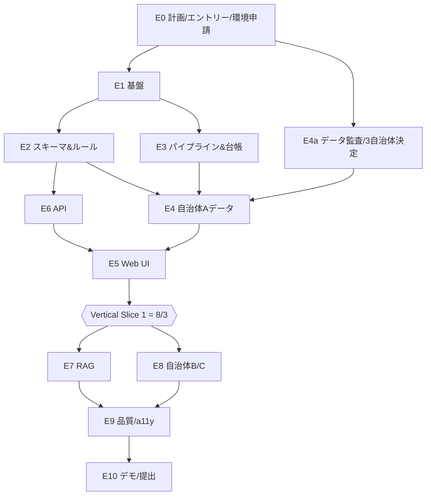

Status: APPROVED — 2026-07-21 ユーザー承認(T-000エントリー提出済み。実装開始指示を受領)

# 東京転入ToDo(仮称) 実装計画書

- 文書バージョン: 0.1.0 / 作成日: 2026-07-21
- ベースライン: REQUIREMENTS.md 0.1.0
- 絶対期日: **エントリー 2026-07-27(月) 17:00** / **作品提出 2026-08-23(日)**(締切時刻未公表→8/21提出を内部目標)

## 1. Executive summary

東京転入者が最低限の入力(転入先・引越し日・転入元・世帯構成・条件フラグ)から、公式根拠と最終確認日付きの期限順ToDoチェックリストを得られるMVPを、2026-08-23までに3自治体対応で完成させる。

方針の柱:

1. **1自治体縦切り最優先**: Week 1で「自治体A(推奨: 世田谷区)×単身都外転入」のエンドツーエンド(入力→チェックリスト→詳細→根拠)をCloudflare上で動かし、以後は横展開と深化に徹する。
2. **決定論的ルールエンジン**: チェックリスト判定はバージョン付き宣言的JSONルール+TypeScript純関数評価器。LLMは判定に一切関与しない。
3. **来歴ファースト**: 全公開タスクは承認済みソース台帳(sourceId・URL・contentHash・lastVerifiedAt・reviewStatus)に紐付く。Gitベースの人手レビューを公開の唯一の経路とする。
4. **RAGは後付け可能な独立モジュール**: チェックリスト完成後に統合。承認済みスナップショットのみをコーパスとし、自治体コードで検索をサーバー側強制フィルタ。根拠不足時は保留。RAG停止時もチェックリストは無傷。
5. **Cloudflareネイティブ**: 単一Worker(Hono+静的アセット)+D1+R2+Vectorize+Workers AI embeddings+AI Gateway経由Claude API。ハッカソンから**Cloudflare Paidプラン相当が申請制で提供される**(公式要項で確認済み、9月末まで)ため提供環境と完全整合。

事前調査の重要な発見: **エントリー(7/27)時に「利用予定オープンデータ最大10件」と約300字×6項目の記述が必要**。したがってW0の最優先タスクはエントリー内容の確定であり、事前監査済みのデータ候補リスト(§5.5)をそのまま流用する。

スケジュールは W0(〜7/27)計画承認・エントリー・データ監査と3自治体決定 → W1(〜8/3)Vertical Slice 1 → W2(〜8/10)VS1完成+取込パイプライン+RAG基盤 → W3(〜8/17)自治体B/C+子育てペルソナ+RAG評価+ユーザーテスト → W4(〜8/23)全ソース再確認・release-check・提出物(2分スライド+2分動画+キャプチャ3点)作成・提出(目標8/21)。

間に合わない場合の削減順は「P1全部→地図→ごみ地区粒度→自治体C→RAGチャット縮退→自治体B」。最終防衛線は「1自治体の完全な縦切り+未対応の誠実な明示」。

## 2. Assumptions

| #    | 仮定                                                                                                                                                 | 根拠/リスク                                                                         | 検証タスク                                                                       |
| ---- | ---------------------------------------------------------------------------------------------------------------------------------------------------- | ----------------------------------------------------------------------------------- | -------------------------------------------------------------------------------- |
| A-1  | 提出物 = 提出フォーム①〜⑥(各300字程度)+2分プレゼンスライド(PPT/PDF)+画面キャプチャ最大3点+2分程度のプレゼン動画。デモURLまたは1分操作動画は任意      | **公式要項で確認済み**(2026-07-21取得)。8/23の締切時刻は未公表                      | T-000で提出フォーム実物を確認。時刻不明のため8/21提出を内部期限とする            |
| A-2  | チーム=開発者1名+Claude Code。人手レビューに使えるのは1日1〜2時間                                                                                    | スケジュールの律速要因                                                              | W0で実測し、W1終了時に見積り再調整                                               |
| A-3  | ハッカソン提供のCloudflare Paid相当が使える(申請制・9月末まで)。付与前・不付与時も無料枠+自費$5/月で成立                                             | 公式要項で提供自体は確認済み。具体スペック内訳は未公表                              | T-000でエントリーと同時に利用申請。付与内容を確認しADR-001に追記                 |
| A-4  | LLMはClaude API(自前キー)をAI Gateway経由で使用。予算上限 $50。AI GatewayはAnthropic公式サポート・全プラン無料                                       | Cloudflare公式ドキュメントで確認済み                                                | AI Gatewayでコスト分析・キャッシュ・レート制限を初期から有効化                   |
| A-5  | 3自治体の主要手続きページはHTMLで取得・引用可能。ごみ・施設は少なくとも一部が機械判読データ                                                          | 事前調査で5自治体分は確認済み(§5.3)。ただし単一エージェント調査のため本監査で再検証 | T-004本監査で全ソースを台帳登録・実データ取得検証                                |
| A-6  | 郵便番号→町丁目の自動解決はMVP不要。町丁目は選択式UIで足りる。町丁目マスタは世田谷区ごみ収集曜日CSV等の公的データから生成可能                        | 住所・地図トピックの事前調査は未完了(レート制限)。FR-013と整合                      | T-005で自治体Aの町丁目マスタ生成時に確認。不足時は国勢調査町丁目データを追加調査 |
| A-7  | 地図はP0では必須でない(FR-012は「一覧または地図」)                                                                                                   | 一覧で受入条件を満たす                                                              | ユーザーテストで地図の必要度を判定                                               |
| A-8  | ドメインは workers.dev サブドメインで可                                                                                                              | デモURLは任意提出のため要件リスクは低い                                             | T-000                                                                            |
| A-9  | 「3自治体程度」= 目標3・最低2。1自治体は失敗条件                                                                                                     | §16 スコープ削減順に明記                                                            | —                                                                                |
| A-10 | 期限規定(転入届14日以内、児童手当15日特例、マイナンバーカード継続利用90日以内等)は自治体公式ページを一次根拠にルールデータ化する。法令原文は補助根拠 | 事前調査で杉並・八王子・新宿の公式ページに期限明記を確認済み                        | 各手続きのsource-auditで自治体ごとに確認(自治体間で表現が異なる)                 |
| A-11 | 東京都オープンデータカタログはCKAN APIで取得する(カタログHTMLは自動アクセスに403)                                                                    | 事前調査で複数エージェントが独立に確認                                              | scripts/ingestはAPI経由で実装                                                    |

## 3. Open decisions

| #   | 決定事項                                                                           | 推奨案                                                                                                                                                                                                                     | 期日                     |
| --- | ---------------------------------------------------------------------------------- | -------------------------------------------------------------------------------------------------------------------------------------------------------------------------------------------------------------------------- | ------------------------ |
| D-1 | MVP 3自治体の確定                                                                  | **決定済み(2026-07-21): A=世田谷区、B=江東区、C=新宿区。補欠: 杉並区・千代田区**(ADR-006参照。監査で杉並のごみ曜日がJS SaaS依存と判明したため江東に変更)                                                                   | 済                       |
| D-2 | LLMモデル                                                                          | 回答: Claude Haiku 4.5(p95 8秒目標・低コスト)。フォールバックにAI Gatewayのモデルフォールバック機能                                                                                                                        | 2026-07-29               |
| D-3 | **エントリー内容**(チーム名・サービス名・①〜⑥記述・利用予定オープンデータ最大10件) | §5.5のデータ候補リストを使用。**人間のみ実行可能。締切7/27 17:00 — 全タスク中最優先**                                                                                                                                      | 2026-07-25(余裕を持って) |
| D-4 | embeddingモデル                                                                    | bge-m3(1024次元)を第一候補。Vectorizeは**次元を後から変更不可・メタデータindexは投入前作成必須**のため、Paid付与状況と合わせてインデックス作成前に確定。無料枠しか無い場合はembeddinggemma-300m(768次元)で保存数を1.33倍に | 2026-08-05(RAG着手前)    |
| D-5 | ユーザーテスト参加者5名の確保方法                                                  | 知人ネットワーク+オンライン実施                                                                                                                                                                                            | 2026-08-08               |
| D-6 | 管理レビューUI                                                                     | 作らない(Gitベース、ADR-003)                                                                                                                                                                                               | 承認時                   |
| D-7 | RAGのP0範囲                                                                        | チャットUI+5問デモ+30問評価。閾値未達なら§16の縮退                                                                                                                                                                         | 2026-08-17               |
| D-8 | 8/22-23開催「ハッカソンDay.1/2」への参加                                           | 提出直前と重なる。参加するなら8/21提出完了が前提条件になる                                                                                                                                                                 | 2026-08-10               |

## 4. Scope table

### 4.1 P0(Must — 8/23までに完成)

| ID          | 要件(要約)                                   | 実装先                              |
| ----------- | -------------------------------------------- | ----------------------------------- |
| FR-001      | 対応自治体一覧+対応カテゴリ表示              | web: CoveragePage / D1: coverage    |
| FR-002〜004 | 段階入力・暫定生成・再計算                   | web: Wizard / api: POST /checklists |
| FR-005      | 決定論的ルール判定                           | packages/rules                      |
| FR-006      | 期限計算・期限順表示                         | packages/rules(Asia/Tokyo明示)      |
| FR-007〜008 | 該当理由・書類・方法・場所・根拠・最終確認日 | procedure_versions + TaskDetail     |
| FR-009      | 期限不明時「要確認」                         | rules: dueDescription fallback      |
| FR-010〜011 | 完了状態localStorage+条件変更時の整合        | web: storage(procedureIdキー)       |
| FR-012〜013 | 窓口一覧(地図なしで可)・距離断定禁止         | facilities + FacilityList           |
| FR-014〜015 | ごみ導線+地区データがあれば曜日表示          | waste_areas / waste_schedules       |
| FR-016〜019 | RAG: 自治体スコープ・出典・保留・PII注意     | packages/rag + /api/chat            |
| FR-020      | データソース一覧・ライセンス表示             | SourcesPage(CC BY 4.0帰属表示含む)  |
| FR-021      | 未対応自治体の誠実表示                       | CoveragePage + Wizard               |
| FR-022〜024 | スキーマ検証・来歴記録・カバレッジ管理       | scripts/ingest + registry           |

### 4.2 P1(Should — 余裕がある場合のみ。既定では着手しない)

カレンダー/ICS、共有URL/PDF、やさしい日本語/英語、差分検知の自動化(手動再取得スクリプトはP0に含む)、フィードバック送信、郵便番号自動解決、地図表示。

### 4.3 P2(Could — Final Stage以降)

62区市町村拡張、民間連携、マイナポータル導線高度化、詳細条件分岐、通知、アカウント同期、自治体向けダッシュボード。

### 4.4 要件の矛盾・曖昧さと解釈

| #    | 事項                                                                                                                        | 解釈(本計画の扱い)                                                                                                      |
| ---- | --------------------------------------------------------------------------------------------------------------------------- | ----------------------------------------------------------------------------------------------------------------------- |
| C-1  | FR-015(ごみ地区曜日表示)と P1「町丁目自動解決」の境界                                                                       | P0=地区を**選択式**で選べば曜日表示。郵便番号等からの**自動解決**はP1                                                   |
| C-2  | RAGはP0だが工数リスク大                                                                                                     | 独立モジュール+フィーチャーフラグ。§16の縮退パス(検証済みFAQ)を事前定義                                                 |
| C-3  | 「3自治体程度」                                                                                                             | 目標3・最低2(A-9)                                                                                                       |
| C-4  | FR-011「整合を維持または確認」                                                                                              | 完了状態はprocedureIdキーで保持。再計算で非該当になったタスクは非表示化(状態は残す)。表示復帰時に完了状態も復元         |
| C-5  | 郵便番号入力(§7.3 Step1「必要な自治体のみ」)                                                                                | MVPは全自治体で町丁目選択式。郵便番号入力はP1                                                                           |
| C-6  | §11.7 RAG評価30問はMVP必須か                                                                                                | 必須(公開判定の前提)。質問セット作成はデータ作成と並行                                                                  |
| C-7  | REQUIREMENTSは「2分プレゼン+1分操作動画」だが公式要項は「2分スライド+2分プレゼン動画+キャプチャ3点、デモURL/1分動画は任意」 | **公式要項を正とする**(§16.3)。デモURLも任意だが提出する(技術力の証拠)                                                  |
| C-8  | 施設「距離」表示                                                                                                            | MVPでは距離計算・最寄り判定をしない(FR-013)。所在地・アクセス文言のみ表示                                               |
| C-9  | ごみ収集曜日CSVは通年の曜日パターンのみで、祝日・年末年始等の例外日はPDF/アプリにしかない(世田谷で確認)                     | 曜日表示に「祝日・年末年始は変更あり。公式カレンダーで確認」の注意書きを必ず併記。日付展開はMVPでは行わない(誤案内防止) |
| C-10 | 犬の登録はマイクロチップ装着有無で手続き先が分岐(環境省DB vs 区窓口)。3区共通で確認                                         | ルール入力にhasDogに加えdogHasMicrochip(不明可)を追加し、分岐込みでルール化。不明時はneeds_confirmation                 |

## 5. Candidate municipality data-audit plan

### 5.1 評価軸(スコアリング)

各候補を以下6軸×3点(0=不可/1=部分/2=良)で採点し、合計と致命的欠格(手続きページが引用不能等)で判定:

1. **手続きページの公式性・構造**: P0カテゴリ(転入届・マイナンバー・国保・年金・児童手当/子ども医療・学校保育入口・犬)の公式HTMLが安定URLで存在し引用可能か
2. **ごみデータ**: 収集曜日の地区別データが機械判読(CSV/API)か、HTML表か、PDF/アプリのみか
3. **施設データ**: 窓口・出張所のオープンデータ(座標付き)有無
4. **オープンデータ成熟度**: 都カタログ掲載数、ライセンス明確性(CC BY 4.0等)
5. **ペルソナ適合**: 転入者数が多い/単身・子育て両方を検証できるか
6. **監査コスト**: 8/23までに人手確認が現実的か(ページ数・構造の素直さ)

追加条件: 3自治体間で**異なるデータ形式**(CSV/HTML表/検索ツール等)を含めること(スキーマ汎用性の実証)。

### 5.2 調査手順(T-004本監査、W0内)

1. 候補ごとに `/source-audit` スキルでP0カテゴリ×ソースを台帳(`docs/data-sources/registry.csv`)へ candidate 登録
2. URL・所有組織・ライセンス・更新日・有効期間・機械判読性を記録。**事前調査(§5.3)の主張は全件、実データ取得で再検証する**(単一エージェント調査のため)
3. ごみ・施設は実ファイルを取得しスキーマを確認(列名・地区コード体系)。カタログはCKAN API経由(A-11)
4. 未調査の江東区を同手順で監査
5. 6軸採点表を `docs/research/municipality-audit.md` に作成
6. 3自治体+補欠1を選定、`docs/adr/ADR-006-municipality-selection.md` に根拠を記録
7. 人間レビューで確定(D-1、7/26まで)

### 5.3 候補6件と事前調査結果(2026-07-21実施・単一エージェント調査)

| 軸             | 千代田区 13101                   | 新宿区 13104                                | 江東区 13108 | 世田谷区 13112                                        | 杉並区 13115                                         | 八王子市 13201                                                           |
| -------------- | -------------------------------- | ------------------------------------------- | ------------ | ----------------------------------------------------- | ---------------------------------------------------- | ------------------------------------------------------------------------ |
| 手続きHTML     | ◎ 全10カテゴリ確認               | ◎ 全カテゴリ+期限明記                       | **未調査**   | ◎ 安定URL+最終更新日明記                              | ◎ **転入者向けハブページ**(約18項目集約)             | ◎ 構造良好(中核市で犬も市内完結)                                         |
| ごみ収集曜日   | × PDFのみ+アプリ                 | △ 町名×曜日HTML表(令和8年度版)              | 未調査       | **◎ 町丁目別CSV**(資源/可燃/不燃/ペット/清掃事務所列) | △ HTML検索ツール+PDF                                 | × 地区別PDF(約10MB/地区)のみ                                             |
| ごみ分別辞書   | ◎ CSV(CC BY 4.0)                 | ◎ CSV(CC BY 4.0, 2025-12更新)               | 未調査       | ◎ CSV(90KB, CC BY 4.0)                                | ◎ 都カタログにCSV                                    | △ HTML50音+PDF                                                           |
| 施設データ     | ◎ 公共施設CSV(ただし2024-12更新) | ◎ **GIF標準準拠施設CSV**+137データセット    | 未調査       | ◎ 公共施設CSV+**ArcGIS Hub(API/GeoJSON)**             | ◎ 公共施設CSV(基準日2024-04)                         | △ HTML分散、市発CSVなし                                                  |
| オンライン申請 | マイナポータル中心・分散         | LoGoフォーム+ぴったり(旧共同電子申請は終了) | 未調査       | 4系統混在(共同/ぴったり/LoGo/けやきネット)            | LoGoフォーム+ぴったりに整理済み                      | 東京共同電子申請と記載(**要再確認**: 同サービスは令和7年3月終了情報あり) |
| 主な懸念       | 収集曜日の構造化コスト大・人口小 | 収集曜日はHTML表(年度更新追従が必要)        | —            | 例外日(祝日等)はPDF/アプリのみ(C-9)                   | 収集曜日ツールのスクレイピング必要・データ基準日古め | オープンデータ弱・子育て系が別ドメイン分裂                               |

共通リスク(全自治体で確認): 手続きHTML本文のライセンスはオープンデータ指定外(利用規約確認が必要。要約+リンク+出典表示で設計)/CMSリニューアルでのURL変更/ごみカレンダーの年度更新(毎年4月)/LoGoフォーム等外部SaaSリンクの死活監視。

### 5.4 暫定推奨(T-004で最終確定)

- **自治体A(VS1) = 世田谷区**: 唯一、ごみ収集曜日が町丁目別CSVで取得可能(FR-015を最も忠実に実証できる)。手続きページに最終更新日明記、ArcGIS APIまで有し「データ活用」審査基準に最適。人口92万でペルソナ母数も最大
- **自治体B = 杉並区**: 転入者向けハブページが手続き網羅の一次根拠として最良。世田谷と異なる形式(HTML検索ツール)でスキーマ汎用性を実証
- **自治体C = 新宿区**: GIF標準準拠施設CSV+HTML表形式の収集曜日で第3の形式。単身転入・外国籍住民が多くペルソナ多様性に寄与
- **補欠 = 千代田区**: 全カテゴリ調査済みで差し替え可能だが、収集曜日PDFのみ・夜間人口が小さい
- 八王子市は市部の代表性はあるがオープンデータが弱く2ドメイン分裂で監査コスト高。江東区は未調査のためT-004で評価し、上位を上回れば入れ替え

### 5.5 エントリー用「利用予定オープンデータ」候補(最大10件、D-3で使用)

1. 世田谷区 資源・ごみ収集曜日一覧CSV(CC BY 4.0) 2. 世田谷区 ごみ分別一覧CSV 3. 世田谷区 公共施設一覧CSV(自治体標準オープンデータセット) 4. 新宿区 GIF施設一覧CSV 5. 新宿区 ごみ分別方法一覧CSV 6. 杉並区 公共施設一覧CSV 7. 千代田区 公共施設一覧CSV 8. 通学区域一覧CSV(世田谷/千代田) 9. 東京都オープンデータカタログ(CKAN API) 10. 各区公式手続きページ(公式Web情報として)

## 6. Architecture decision

### ADR-001: Cloudflareネイティブ構成を採用(Proposed)

**決定**: pnpm monorepo / React+Vite SPA / Hono on Cloudflare Workers(静的アセット同居の単一Worker)/ D1 / R2 / Vectorize / Workers AI(embeddings)/ AI Gateway経由Claude API / Zod / Vitest+Playwright+axe-core / GitHub Actions。

**事前調査で確認済みの成立根拠**(Cloudflare公式ドキュメント、2026-07-21取得):

- 単一Worker構成: Workers Static Assetsが `not_found_handling: "single-page-application"` + `run_worker_first: ["/api/*"]` を公式サポート。@cloudflare/vite-pluginでVite統合。静的アセット配信は実質無課金
- D1無料枠: 500MB/DB・読み500万行/日・書き10万行/日 — 本MVPのデータ量(3自治体×数十手続き)には十分
- Vectorize: メタデータフィルタ($eq/$in、string対応)で自治体コードスコープが成立。**制約: metadata indexはベクトル投入前に作成必須。次元は後から変更不可**
- AI Gateway: Anthropic公式サポート(baseURL差し替えのみ)。ログ・コスト分析・キャッシュ・レート制限・フォールバックが全プラン無料
- テスト: @cloudflare/vitest-pool-workers(Vitest 4.1+)でworkerd内・バインディング込みのテストが可能

**無料枠の唯一の重大ボトルネック**: Vectorize保存500万次元/月 = 1024次元で約4,880ベクトル。3自治体RAGコーパスは数百〜数千チャンク見込みで際どい。**対策: ハッカソン提供のCloudflare Paid相当(A-3)を申請。不付与でも自費$5/月のWorkers Paidで保存1,000万次元+CPU 30秒化+D1緩和が得られ、これが最小コストの解**。

**比較**:

| 観点               | A: Cloudflareネイティブ(採用) | B: Next.js on Cloudflare(OpenNext) | C: Vercel+Next.js+Supabase(pgvector) |
| ------------------ | ----------------------------- | ---------------------------------- | ------------------------------------ |
| ハッカソン環境整合 | ◎ **Paid相当が公式提供**      | ○                                  | × 提供環境を放棄                     |
| 構成要素数/運用    | ◎ 単一プラットフォーム        | △ ビルドチェーン複雑               | △ 2サービス跨ぎ                      |
| SSR必要性          | 不要(ツール型SPA。SEO不要)    | SSRが強みだが不要                  | 同左                                 |
| ベクトル検索       | Vectorize(フィルタ確認済み)   | 同左                               | pgvector(柔軟だが運用+)              |
| コスト             | 無料枠中心+提供Paid           | 同左                               | 無料枠依存+超過リスク                |
| デモ安定性         | ◎ エッジ配信・LLM非依存経路   | ○                                  | ○                                    |
| リスク             | Vectorize無料枠(対策済み)     | OpenNext互換性問題                 | 環境分裂                             |

**理由**: SSR不要のツール型SPAでBの利点が活きず、Cは提供環境と審査アピール(データ活用×都提供環境)を捨てる。Aが期限・運用・整合の全てで優位。

**帰結**: D1のSQLite方言に依存。将来のRDB移行はスキーマ層で緩和。

### ADR-002: ルール表現 = 宣言的JSON+TS純関数評価器(Proposed)

- ルールは `packages/rules/data/<municipalityCode>/*.rule.json`。条件式は制限DSL: `all` / `any` / `not` + 述語(`originType in [...]`, `flag == true`, `ageBands intersects [...]`, `memberCount >= n`)のみ。任意コード・LLM呼び出し不可
- 評価器は純関数 `evaluate(profile, ruleSet, ruleVersion) -> RuleOutcome[]`(§9.3の出力: applicable / needs_confirmation / 理由 / 期限 / sourceIds / warnings)
- 期限は `dueRule: { type: "offsetDays", from: "moveDate", days: 14 }` 等の宣言表現+`dueDescription`(公式文言)併記。算定不能は `needs_confirmation`。事前調査で確認済みの期限例: 転入届14日以内(世田谷・新宿)、児童手当15日特例(新宿・八王子)、マイナンバーカード継続利用90日以内(杉並・八王子) — **いずれも対象自治体の公式ページで個別に再確認してからルール化**
- 日付計算はAsia/Tokyo固定の純関数ユーティリティに集約しテスト
- ルールセットは `ruleVersion`(日付+連番)で管理。生成タスクに使用版を刻印
- **却下案**: TSベタ書き(データ化できず自治体差分管理が破綻)、汎用JSON Logic(表現力過剰で検証困難)

### ADR-003: 管理レビュー = Gitベース(Proposed)

データ・ルールの追加/変更はすべてPR。CIがスキーマ検証・ルール回帰・来歴チェック(公開タスクに承認済みソースが紐付くか)を実行し、人間がPRレビューで公式ページと照合して承認。レビューUIは作らない。**理由**: 期限・監査証跡・1人チーム。台帳CSVとレビュー記録はリポジトリ内で完結。

### ADR-004: RAG構成(Proposed)

- コーパス: R2の承認済みスナップショット(HTML本文抽出済み)のみ。取込時に `municipalityCode / category / procedureId / sourceId / lastVerifiedAt / effectiveTo / reviewStatus` をメタデータ付与
- 索引: Workers AI embeddings(bge-m3 1024次元。D-4参照)→ Vectorize。**インデックス作成前にmetadata index(municipalityCode等のstring index)を作成**(公式制約)。検索時に `municipalityCode` と `reviewStatus=approved` を**サーバー側で強制フィルタ**(クライアント指定不可)
- 生成: AI Gateway経由Claude API(Haiku 4.5)。プロンプトは「引用チャンク外の事実を述べない・根拠不足なら保留」を強制、出力にsourceId引用必須。出力検証で引用なし回答をブロックし保留文へ差し替え
- インジェクション対策: 本文抽出でscript/form/nav除去、取得文書内の命令文を無視する旨のシステム指示、RAGモデルにツール権限なし
- 失敗時: /api/chat 停止・タイムアウトでもUI本体は無影響。§11.5の保留・矛盾・stale動作を実装
- チェックリスト生成コードとは完全分離(packages/rag)。フィーチャーフラグ `RAG_ENABLED`

### ADR-005: 地図・住所解決(Proposed)

- MVP: 施設は**一覧表示**(FR-012充足)。地図はP1(採用時 MapLibre GL JS+地理院タイル。**利用条件・出典表示の確認は未了 — P1着手時の検証タスク**)
- 住所入力: 自治体選択+町丁目**選択式**。ジオコーダ・郵便番号APIは使わない。町丁目マスタは世田谷区ごみ収集曜日CSVの町丁目列等の公的データから生成(A-6)
- 距離・最寄り計算はしない(FR-013)

### 論理構成図

```mermaid
flowchart LR
  U[利用者] --> W[React SPA<br/>Vite/静的アセット]
  W --> API[Hono API Worker<br/>run_worker_first: /api/*]
  API --> RE[ルールエンジン<br/>packages/rules 純関数]
  RE --> D1[(D1: 手続き/ルール/施設/ごみ/台帳)]
  API --> RAG[RAGモジュール<br/>flag: RAG_ENABLED]
  RAG --> VZ[(Vectorize<br/>municipalityCode強制フィルタ)]
  RAG --> GW[AI Gateway] --> LLM[Claude API]
  RAG -.embeddings.-> WAI[Workers AI bge-m3]

  subgraph 取込・公開パイプライン（ローカル/CI実行）
    SRC[公式ページ/オープンデータ<br/>CKAN API経由] --> ING[scripts/ingest<br/>取得+正規化]
    ING --> R2[(R2: 原文スナップショット+hash)]
    ING --> VAL[Zodスキーマ検証+差分]
    VAL --> PR[Git PR = 人手レビュー]
    PR --> PUB[scripts/publish<br/>承認済のみ D1/Vectorizeへ]
  end
  PUB --> D1
  PUB --> VZ
```

## 7. Repository tree

リポジトリルートは本ディレクトリ。スターターパックの内容(`CLAUDE.md`, `REQUIREMENTS.md`, `.claude/`, `docs/*.csv` 等)を `tokyo_move_navi_requirements/` からルートへ移設し、`git init` する(T-001)。

```text
.
├── apps/
│   ├── web/                 # React+Vite SPA(Wizard/Checklist/TaskDetail/Facilities/Waste/Chat/Sources/Coverage)
│   └── api/                 # Hono Worker(静的アセット配信同居、wrangler.jsonc)
├── packages/
│   ├── schemas/             # Zod: Profile/Procedure/Rule/Source/Task DTO/API契約(単一の真実)
│   ├── rules/               # 評価器(純関数)+ data/<municipalityCode>/*.rule.json + 期限計算util
│   ├── domain/              # エンティティ型・カテゴリ定数・自治体コード
│   ├── rag/                 # チャンク化/検索/回答生成/出力検証(flagで分離)
│   └── test-fixtures/       # プロフィール/ルール/手続きのfixture
├── data/
│   ├── sources/<municipalityCode>/    # 原文スナップショット参照(R2キー+hash)
│   ├── normalized/<municipalityCode>/ # 正規化済みJSON(procedures/facilities/waste)
│   └── evaluations/         # RAG評価30問+期待出典
├── scripts/
│   ├── ingest/              # fetch(CKAN API/HTML)→R2保存→hash→台帳更新→本文抽出→差分
│   ├── validate/            # スキーマ検証・来歴リンクチェック(CIで実行)
│   └── publish/             # 承認済み→D1シード/Vectorize upsert
├── docs/
│   ├── IMPLEMENTATION_PLAN.md
│   ├── adr/                 # ADR-001..006
│   ├── data-sources/registry.csv      # ソース台帳(テンプレ準拠)
│   ├── data-sources/coverage.csv      # 自治体×カテゴリ対応状況
│   └── research/            # 監査結果・要項確認メモ・事前調査結果
├── tests/e2e/               # Playwright+axe-core
├── .github/workflows/ci.yml # format/lint/typecheck/unit/rule回帰/validate
├── .claude/                 # 同梱skills+settings(移設)
├── CLAUDE.md / REQUIREMENTS.md / CLAUDE_CODE_SETUP.md
└── pnpm-workspace.yaml
```

## 8. Data model and API outline

### 8.1 D1テーブル(主要列のみ)

| テーブル                      | 主要列                                                                                                                                                                                                                  | 備考                                          |
| ----------------------------- | ----------------------------------------------------------------------------------------------------------------------------------------------------------------------------------------------------------------------- | --------------------------------------------- |
| municipalities                | code PK, name, supported, note                                                                                                                                                                                          |                                               |
| coverage                      | municipality_code, category, status(verified/partial/unavailable), last_verified_at                                                                                                                                     | FR-024                                        |
| sources                       | source_id PK, municipality_code, category, title, owner, url, source_type, license, attribution, review_status, last_fetched_at, last_verified_at, content_hash, effective_from/to                                      | 台帳CSVと同期                                 |
| source_snapshots              | id PK, source_id FK, r2_key, content_hash, fetched_at                                                                                                                                                                   | 原文はR2                                      |
| procedures                    | procedure_id PK, municipality_code, canonical_type, current_version                                                                                                                                                     |                                               |
| procedure_versions            | procedure_id, version, title, short_description, priority, due_rule(JSON), required_documents(JSON), channels(JSON), location_ids(JSON), online_url, contact, source_ids(JSON), last_verified_at, data_status, cautions | REQUIREMENTS §10の全フィールド                |
| rule_sets                     | municipality_code, rule_version, rules(JSON)                                                                                                                                                                            | ADR-002                                       |
| facilities                    | facility_id PK, municipality_code, name, category, address, lat/lng nullable, hours, source_id                                                                                                                          |                                               |
| waste_areas / waste_schedules | area_id, municipality_code, area_label / area_id, waste_type, weekday, week_of_month, source_id, effective_from/to                                                                                                      | 年度データは有効期間必須。例外日注意書き(C-9) |
| rag_chunks                    | chunk_id, municipality_code, source_id, procedure_id?, category, text, last_verified_at                                                                                                                                 | ベクトルはVectorize側。D1は原文突合用         |

ユーザープロフィール・完了状態・チャット内容はサーバーに保存しない(D1にユーザーテーブルを作らない)。完了状態は `localStorage["tmn:done:<municipalityCode>"] = { [procedureId]: {doneAt, ruleVersion} }`。

### 8.2 API(REQUIREMENTS §14を確定)

| Method/Path                                  | 入出力(Zod契約)                                                                           | 備考                                    |
| -------------------------------------------- | ----------------------------------------------------------------------------------------- | --------------------------------------- |
| GET /api/municipalities                      | → {code,name,supported,coverage[]}                                                        | FR-001/021                              |
| POST /api/checklists                         | Profile(§14.1) → {tasks[](§14.2), ruleVersion, generatedAt}                               | ステートレス。サーバー保存なし。p95 2秒 |
| GET /api/procedures/:id?municipality=        | → ProcedureVersion全fields+sources                                                        |                                         |
| GET /api/facilities?municipality=&category=  | → Facility[]                                                                              |                                         |
| GET /api/waste-schedules?municipality=&area= | → WasteSchedule[]+areas[]                                                                 | area未指定なら地区一覧                  |
| POST /api/chat                               | {municipalityCode, procedureId?, question} → {answer, citations[], confidence, abstained} | flag制御。レート制限                    |
| GET /api/sources                             | → 台帳公開ビュー(FR-020)                                                                  |                                         |
| POST /api/profile/resolve                    | P1(郵便番号解決)。MVPは未実装で予約のみ                                                   |                                         |

全エンドポイント: Zod入力検証、構造化ログ(requestId、PIIなし)、レート制限(特に/chat)、エラーは次の行動が分かる文面。

## 9. Vertical Slice 1 acceptance criteria(自治体A=世田谷区(暫定)×単身・都外転入)

期限: 8/3。以下を**全て**満たすこと:

1. 対応自治体一覧に自治体Aが「対応」、他が「未対応+公式リンク」で表示される
2. 3ステップ入力(自治体A・引越し日・都外/単身/フラグ)が60秒以内に完了できる(モバイル幅)
3. 7±1件のP0手続き(転入届・マイナンバー・国保(該当時)・年金(該当時)・犬(該当時)・ごみ確認・任意1〜2件)が期限順セクション(転入後すぐ/14日以内/生活開始/該当者のみ)で表示される
4. 全タスクカードに優先度・期限(または要確認)・1行理由が表示され、詳細に必要書類・方法・場所・**公式URL・最終確認日**が表示される
5. フラグを変えると該当タスクが決定論的に増減する(例: 国保フラグOFF→国保タスク消滅)
6. 完了チェックがリロード後も保持される
7. 窓口一覧に自治体Aの本庁舎+出張所が公式ソース付きで表示される
8. ごみページに自治体Aの分別導線+最低1地区の曜日が表示される(地区は選択式、例外日注意書き付き)
9. 全公開タスクのsourceIdが台帳のapprovedレコードを指す(CIで機械検証)
10. ルールの正例・負例・境界テスト(自治体A分)がCIでpass
11. Cloudflare上のプレビューURLで上記が再現できる
12. サーバーログに完全住所・世帯詳細・PIIが出ない(ログ検査テスト)

RAGはVS1に**含めない**(W2)。

## 10. Epics and dependency graph

- **E0 計画・エントリー**(本計画+D-3+Cloudflare提供環境申請)
- **E1 基盤**: repo/monorepo/CI/デプロイ
- **E2 スキーマ&ルールエンジン**: Zod契約+評価器+期限計算
- **E3 データパイプライン&台帳**: ingest/validate/publish+source registry
- **E4 自治体Aデータ**: 監査→スナップショット→正規化→ルール→承認
- **E5 Web UI**: Wizard/Checklist/Detail/Facilities/Waste/Coverage/Sources
- **E6 API**: Hono+D1+契約実装
- **E7 RAG**: 取込→索引→回答→保留→評価
- **E8 自治体B/C横展開**(add-municipality手順)
- **E9 品質&アクセシビリティ**: E2E/a11y/性能/セキュリティ
- **E10 デモ&提出**: 再確認/release-check/スライド/動画/キャプチャ



## 11. Detailed task list

依存・完了条件付き。担当: 人間🧑 / Claude Code🤖 / 両方👥

| ID       | タスク                                                                                                                                                   | 依存        | 完了条件(DoD)                                                                | 週   |
| -------- | -------------------------------------------------------------------------------------------------------------------------------------------------------- | ----------- | ---------------------------------------------------------------------------- | ---- |
| T-000 🧑 | **エントリー提出**(①〜⑥各300字+利用予定オープンデータ最大10件=§5.5)+**Cloudflare Paid相当・OpenCodeの利用申請**+要項の提出物詳細を`docs/research/`へ記録 | —           | エントリー完了(**7/27 17:00厳守**、7/25目標)。環境申請済み                   | W0   |
| T-001 🤖 | リポジトリ初期化: スターター移設、git init、pnpm workspace、CI雛形、wrangler設定、CFアカウント確認                                                       | 計画承認    | CI(空)green、`wrangler deploy`でHello Worker                                 | W0   |
| T-002 🤖 | packages/schemas: Profile/Rule/Procedure/Source/Task DTO/API契約のZod+型                                                                                 | T-001       | 全スキーマにユニットテスト、REQUIREMENTS §9-§14と1:1対応表                   | W0-1 |
| T-003 🤖 | packages/rules: 評価器+期限計算(JST)+fixtureテスト(正/負/境界/needs_confirmation/自治体越境)                                                             | T-002       | ダミールールで全出力型を網羅、カバレッジ>90%                                 | W1   |
| T-004 👥 | **本データ監査**: 6候補(江東区含む)×P0カテゴリを/source-auditで台帳登録、事前調査の全主張を実データで再検証、採点表、3+1選定、ADR-006                    | T-000       | registry.csvにcandidate/approved記録、D-1決裁                                | W0   |
| T-005 👥 | 自治体Aデータ: スナップショット取得(R2)→正規化→手続き7±1件+ルール+施設+ごみ(収集曜日CSV+町丁目マスタ生成)→PRレビュー承認                                 | T-003,T-004 | 全タスクにapprovedソース+lastVerifiedAt。ルールテストpass                    | W1   |
| T-006 🤖 | D1スキーマ+publish: migrations、承認済みデータのシード、GET /municipalities、POST /checklists                                                            | T-003,T-005 | API統合テスト(vitest-pool-workers)pass、p95<2s(ローカル計測)                 | W1   |
| T-007 🤖 | Web: 3ステップWizard(各質問に目的説明)+暫定チェックリスト生成                                                                                            | T-006       | モバイル幅で入力→結果60秒以内。キーボード操作可                              | W1   |
| T-008 🤖 | Web: チェックリスト画面(期限順セクション/進捗/完了localStorage/FR-011整合)                                                                               | T-007       | VS1基準3,5,6を満たす                                                         | W1   |
| T-009 🤖 | Web: タスク詳細+根拠カード+dataStatus表示(verified/partial/stale)                                                                                        | T-008       | VS1基準4。根拠カード1タップ                                                  | W1   |
| T-010 🤖 | Web: 窓口一覧+ごみ(地区選択式・例外日注意)+Coverage+Sourcesページ(CC BY帰属表示)                                                                         | T-006       | VS1基準1,7,8+FR-020/021                                                      | W1-2 |
| T-011 🤖 | デプロイ整備: 単一Worker(静的アセット+API)、環境分離、secrets、プレビューURL                                                                             | T-006       | **VS1受入(§9)全項目pass = 8/3マイルストーン**                                | W1   |
| T-012 🤖 | scripts/ingest+validate: 取得(CKAN API/HTML)→R2→hash→台帳更新→本文抽出→差分表示→CI検証(来歴リンク切れ検出)                                               | T-005       | 自治体Aの全ソースがスクリプト経由で再取得・差分確認可能                      | W2   |
| T-013 🤖 | RAG: D-4確定→**metadata index作成→**チャンク化→embeddings→Vectorize→/api/chat(強制フィルタ・引用必須・保留・出力検証・レート制限)+チャットUI(PII注意文)  | T-011,T-012 | 5問デモ質問で出典付き回答、スコープ外で保留。RAG停止時に本体無傷(劣化テスト) | W2   |
| T-014 👥 | RAG評価: 30問+期待出典作成→/rag-evalハーネス→閾値判定(出典100%/混入0/根拠なし断定0)                                                                      | T-013       | 評価レポートpass、またはD-7縮退判断                                          | W3   |
| T-015 👥 | 自治体B追加(/add-municipality全手順+子育てペルソナルール: 児童手当・子ども医療・学校保育入口)                                                            | T-011,T-004 | Bで受入基準再現+自治体差分デモ可(A/Bで結果が異なる)                          | W2-3 |
| T-016 👥 | 自治体C追加(同上、第3のデータ形式を担保)                                                                                                                 | T-015       | 3自治体でカバレッジ表が正しく表示                                            | W3   |
| T-017 🤖 | E2E(Playwright: 主要導線/自治体切替/根拠表示/RAG保留)+axe-coreスモーク+性能計測                                                                          | T-011       | 品質ゲート(§12)全pass                                                        | W3   |
| T-018 👥 | ユーザーテスト5名(探索時間比較・見落とし数・「次が分かるか」)                                                                                            | T-011       | REQUIREMENTS §17.2ベースライン記録、改善チケット化                           | W3   |
| T-019 👥 | 提出前再確認: P0全ソース再確認(8/16以降=提出前7日規定)、stale処理、release-check実行                                                                     | T-016,T-017 | /release-checkブロッカー0件                                                  | W4   |
| T-020 👥 | 提出物作成: デモ固定→**2分スライド(PPT/PDF)+2分プレゼン動画+画面キャプチャ3点+デモURL(任意だが提出)+フォーム①〜⑥**→**8/21提出**                          | T-019       | 提出完了。予備日8/22-23                                                      | W4   |

## 12. Test and evaluation strategy

- **単体**: Vitest。ルール(正例/負例/境界/needs_confirmation/**自治体越境誤適用**)、期限計算(JST・月末・年度跨ぎ)、スキーマ
- **回帰**: ルール変更PRごとにfixture全件再実行(CI必須)。ルール出力のスナップショットテストで意図しない差分を検出
- **統合**: @cloudflare/vitest-pool-workers(Vitest 4.1+)でAPI+D1をworkerd内テスト。契約テスト(Zod)で入出力を固定。注意: カバレッジはIstanbul必須(公式既知制限)
- **E2E**: Playwright — ①入力→チェックリスト→詳細→根拠 ②条件変更で増減 ③完了保持 ④未対応自治体 ⑤RAG保留 ⑥RAG停止時の劣化。モバイルビューポート
- **アクセシビリティ**: axe-coreスモーク+キーボードのみ操作の手動チェックリスト(W3)
- **来歴**: scripts/validate — 公開procedure_versionのsource_idsが全てapproved台帳を指すか、lastVerifiedAt欠落がないかをCIで機械検証(FR-022〜024)
- **RAG評価**(REQUIREMENTS §11.7): 30問(3自治体×主要カテゴリ、正答系20/保留系5/越境系5)。指標: retrieval hit rate、正自治体出典率100%、引用整合率、unsupported claim 0、保留適切率、p95レイテンシ8秒
- **PII**: ログ出力のスナップショット検査テスト(住所・氏名パターンがログに現れない)
- **品質ゲート**(release-check): format/lint/typecheck/unit/rule回帰/integration/E2E/a11y/RAG評価/台帳approved/手動データ確認/重大セキュリティ0

## 13. Security / privacy plan

- **データ最小化**: 収集は自治体コード・町丁目(選択式)・引越し日・転入元区分・年齢帯・フラグのみ。氏名/電話/メール/完全生年月日/番地は入力欄自体を作らない
- **非永続化**: プロフィールはリクエスト内のみ。D1にユーザーデータなし。完了状態はlocalStorageのみ。チャット入力はログに残さない(モデル呼び出しのメタデータのみ記録)
- **ログ**: 構造化ログにallowlist方式(municipalityCode/イベント名/requestId/レイテンシのみ)。denylistでなくallowlistで漏洩を構造的に防ぐ
- **アプリ**: 全入力Zod検証、CSP/セキュリティヘッダー、レート制限(/chat厳しめ)、秘密情報はwrangler secrets、管理系エンドポイントは作らない(Gitベース運用のため不要=攻撃面削減)
- **RAGインジェクション**: ADR-004の通り(承認コーパス限定・本文サニタイズ・ツール権限なし・出力検証)
- **依存**: pnpm audit+DependabotをCIに、重大/高は公開ブロック
- **説明表示**: 入力画面に目的・保存範囲・非公式サービスである旨・チャットPII注意(FR-019、REQUIREMENTS §16.2)
- **ライセンス**: オープンデータCSVはCC BY 4.0の帰属表示をSourcesページに実装。手続きHTML本文は転載せず「要約+出典リンク+最終確認日」で扱う(各区サイト利用規約の確認をT-004に含む)

## 14. MCP / Plugins / Skills plan

CLAUDE_CODE_SETUP.mdに従い最小構成:

- **導入(W0-W1)**: typescript-lsp、security-guidance、github(最小権限)、cloudflare公式プラグイン(読み取り/プレビュー中心)。Playwright MCP(project scope、テスト環境限定)はE2E着手のW2-3から
- **導入しない**: 汎用filesystem/shell MCP、出所不明スクレイピングMCP、本番書込MCP
- **Skills運用**: `/source-audit`(全ソース登録時必須)、`/add-municipality`(B/C追加)、`/rag-eval`(W3)、`/release-check`(W4)。本計画の更新は `/plan-mvp`
- **Subagents**: data-auditor(read-only、監査の大量ページ読解)、rule-reviewer(境界・越境レビュー)、privacy-security-reviewer(リリース前独立レビュー)、ux-accessibility-reviewer(W3)
- **Hooks(スタック確定後)**: 編集後format、pre-commitでlint+typecheck+unit、`.env`/承認済みスナップショット/`registry.csv`直接編集のブロック(台帳はスクリプト経由のみ)
- **権限**: 全トークン最小権限・短命。`.mcp.json`に秘密なし。本番書込は通常セッション不可。OpenCode(提供LLM環境)は付与後に権限範囲を確認してから利用判断

## 15. Schedule to 2026-08-23

前提: 平日夜+週末稼働、人手レビュー1〜2h/日(A-2)。**絶対期日: エントリー7/27(月)17:00、提出8/23(日)(時刻未公表→内部目標8/21)**。

| 週  | 期間               | ゴール                                | 主要タスク                                                                                                                                                                                                         |
| --- | ------------------ | ------------------------------------- | ------------------------------------------------------------------------------------------------------------------------------------------------------------------------------------------------------------------ |
| W0  | 7/21(火)〜7/27(月) | 計画承認・**エントリー**・3自治体決定 | 7/21-22: 計画レビュー承認、T-001開始 / 7/23-25: T-004本監査+ADR-006、**T-000エントリー内容確定→7/25提出目標** / 7/26: D-1決裁、T-002 / **7/27 17:00: エントリー最終期限**                                          |
| W1  | 7/28(火)〜8/3(月)  | **Vertical Slice 1完成**(§9全基準)    | 7/28-29: T-003ルールエンジン / 7/29-31: T-005自治体Aデータ+T-006 API / 8/1-2: T-007〜T-010 UI / 8/3: T-011デプロイ+VS1受入判定                                                                                     |
| W2  | 8/4(火)〜8/10(月)  | パイプライン+RAG基盤+自治体B着手      | 8/4-5: T-012 ingest/validate / 8/5: D-4 embedding確定+metadata index作成 / 8/6-8: T-013 RAG一式 / 8/9-10: T-015自治体B(子育てルール)                                                                               |
| W3  | 8/11(火)〜8/17(月) | 3自治体+評価+テスト完了               | 8/11-12: T-015完了・T-016自治体C / 8/13-14: T-014 RAG評価30問→D-7判断 / 8/15-16: T-017 E2E/a11y、T-018ユーザーテスト / 8/17: バッファ+D-7最終判断                                                                  |
| W4  | 8/18(火)〜8/23(日) | 提出                                  | 8/18-19: T-019全P0ソース再確認(REQUIREMENTS §12.5の提出前7日規定を充足)+release-check / 8/20: T-020スライド+動画+キャプチャ / **8/21: 提出** / 8/22-23: 予備(不具合修正・再提出のみ。ハッカソンDay.1/2と重複、D-8) |

デイリー運用: 各日の終わりにCIグリーン+デプロイ可能状態を維持(トランクベース)。各週最終日夜に週次ゴール判定、未達なら§16の削減順を発動。提出後の8/26-30にFirst Stage収録(2分プレゼン)があるため、W4でプレゼン練習も行う。

## 16. Risk register and fallback plan

### 16.1 リスク台帳

| リスク                                     | 兆候(トリガー)                             | 対策/フォールバック                                                                                               |
| ------------------------------------------ | ------------------------------------------ | ----------------------------------------------------------------------------------------------------------------- |
| エントリー失念・不備                       | —                                          | **T-000を最優先・7/25提出目標**で2日のバッファ。①〜⑥とデータ10件は本計画§5.5から転記可能                          |
| 事前調査の誤り(単一エージェント調査のため) | T-004再検証でCSV URL切れ・ライセンス相違等 | 台帳はT-004の実データ検証を正とする。世田谷CSVが不成立なら補欠(千代田)繰上げ+ごみは縮退(下記)                     |
| ごみ収集データの年度更新・例外日           | 令和8年度版への切替検出                    | 有効期間(effective_to)必須+stale自動降格。例外日は表示せず注意書きで公式カレンダーへ誘導(C-9)                     |
| W1でVS1未達                                | 8/3受入で3項目以上fail                     | W2前半をVS1完了に充当し、RAGをW3へ後ろ倒し(D-7を8/13に前倒し判断)                                                 |
| RAG評価閾値未達                            | 8/14評価でfail                             | チャットUIを「検証済みFAQ(5〜10問、出典付き静的回答)+公式リンク検索」に縮退。RAGコードは温存しFinal Stageで再挑戦 |
| Vectorize無料枠不足(Paid未付与時)          | 保存次元が500万に接近                      | 自費$5/月でWorkers Paid化(保存1,000万次元)。または768次元モデル(D-4)・チャンク削減                                |
| 公式ページ改版でソース陳腐化               | T-019再確認で差分検出                      | 該当タスクをstale表示に自動降格→再監査→再承認。間に合わなければ当該カテゴリをpartialに降格(誠実表示)              |
| 外部SaaS(LoGoフォーム等)リンク切れ         | リンクチェッカー検出                       | オンライン申請リンクは深いフォームURLでなくカテゴリトップ階層に留める(事前調査の教訓)                             |
| LLM/外部API障害(デモ中)                    | —                                          | デモはチェックリスト経路を主(LLM非依存)。RAGデモは録画+回答キャッシュ                                             |
| 1人チームの稼働不足                        | 週次ゴール2回連続未達                      | §16.2の削減順を即時発動。「深さ>広さ」を堅持                                                                      |

### 16.2 スコープ削減順(8/23に間に合わない場合、上から順に削る)

1. P1全機能(既定で未着手を維持)
2. 地図表示 → 窓口一覧のみ(FR-012は一覧で充足)
3. ごみの地区単位曜日 → 自治体単位の分別導線+代表1地区のみ
4. 自治体C → 2自治体+カバレッジ表で「対応予定」を明示
5. RAGチャット → 検証済みFAQ(出典付き)に縮退(FR-016〜019は縮退形で説明)
6. 自治体B → 1自治体(**最終防衛線**: 自治体A縦切り+未対応の誠実表示+来歴・テスト完備で「深さ」を証明)

削減しても崩さないもの: 公式根拠100%・最終確認日・決定論的ルール・PII非永続化・未対応の明示。

### 16.3 固定デモシナリオ

提出物(公式要項準拠): 2分プレゼンスライド+2分プレゼン動画+画面キャプチャ最大3点+デモURL(任意だが提出)。

**2分プレゼン動画の構成**:

1. (0:00) 課題: 転入手続き情報の分散を1画面で提示
2. (0:15) 自治体A(世田谷区)選択→単身・都外・引越し日入力(3ステップ、実測40秒以内を早送り)
3. (0:35) チェックリスト: 期限順セクション、転入届が「14日以内」で最上位
4. (0:45) タスク詳細→**根拠カード**(公式URL+最終確認日)
5. (0:55) 世帯を「夫婦+未就学児」に変更→児童手当・子ども医療が**増える**(決定論的再計算)
6. (1:10) 自治体切替→同条件でToDoが**変わる**(自治体差分)、ごみ曜日が町丁目で変わる(オープンデータ活用)
7. (1:25) RAG: 出典付き回答/スコープ外質問には**保留+公式誘導**
8. (1:45) カバレッジ表・データソース一覧(誠実性)→クロージング

**画面キャプチャ3点**: ①期限順チェックリスト(根拠カード展開) ②世帯変更前後の差分 ③RAG保留応答+出典表示。
バックアップ: 全手順の録画+RAG回答キャッシュ。ネットワーク断でもローカルで再現可能にする。

## 17. Definition of Ready(実装開始条件)

- [ ] 本計画書が人間に承認され、Statusが `APPROVED` に更新されている
- [ ] エントリー(T-000)が完了している(7/27 17:00まで)
- [ ] Cloudflare提供環境の利用申請が済んでいる(付与待ちでも可、無料枠で開始)
- [ ] ADR-001〜005が承認されている(ADR-006は監査後)
- [ ] Cloudflareアカウント・Anthropic APIキー・GitHubリポジトリが準備され、secretsの受け渡し方法が確定している
- [ ] 品質ゲート(§12)がCI定義としてレビュー済み
- [ ] T-004の監査完了後: 3自治体+補欠が決裁され、P0カテゴリ×自治体のカバレッジ目標が coverage.csv に記録されている
- [ ] スコープ削減順(§16.2)に合意している

---

## 付録A: 事前調査の要点(2026-07-21実施、詳細は docs/research/ へ移設予定)

### A.1 ハッカソン公式要項(全て公式ページ取得で確認)

- エントリー: 2026-06-12 14:00〜**07-27(月) 17:00**、Jotformフォーム。**利用予定オープンデータ最大10件+①〜⑥(各300字程度)の記入が必要**
- 作品提出: 7/10〜8/23(締切時刻は未公表)
- 提出物: 2分プレゼンスライド(PPT/PDF)+画面キャプチャ最大3点+2分程度のプレゼン動画+デモURLまたは1分操作動画(任意)
- First Stage: 8/26〜30に2分プレゼン収録(Zoom、8/29のみ都内スタジオ)、結果9月下旬。Final Stage: 10/17(YouTube配信)
- 提供環境: **Cloudflare Paidプラン相当+OpenCode(LLMセット)、申請制、9月末まで**
- 審査基準の全項目は公式ページで未確認(「データ活用」のみ明記)。FAQ: odh-tokyo2026.code4japan.org
- 8/22-23に「ハッカソンDay.1/2」イベントあり(提出期限と重複、D-8)

### A.2 Cloudflare(公式ドキュメントで確認)

- 単一Worker(SPA+API)公式サポート(`single-page-application` + `run_worker_first`)
- 無料枠: Workers 10万req/日・CPU 10ms / D1 500MB/DB / R2 10GB / Vectorize 保存500万次元(**1024次元で約4,880ベクトル=最重要ボトルネック**)・クエリ3,000万次元/月 / Workers AI 10,000 Neurons/日
- Vectorize: 最大1536次元、$eq/$inメタデータフィルタ、**metadata indexは投入前作成必須・次元変更不可**
- embeddings: bge-m3(1024d)/qwen3-embedding-0.6b(1024d)/embeddinggemma-300m(768d)
- AI Gateway: Anthropic公式サポート、ログ・コスト・キャッシュ・レート制限が全プラン無料
- vitest-pool-workers: Vitest 4.1+、workerd内実行、カバレッジはIstanbul必須

### A.3 自治体事前調査(5/6完了。江東区未調査。単一エージェント調査につきT-004で全件再検証)

§5.3の表参照。要点: 世田谷区のみごみ収集曜日の町丁目別CSV(CC BY 4.0)を確認。新宿区はGIF標準準拠施設CSV+分別CSV。杉並区は転入者向けハブページ(約18項目)が一次根拠として優秀。千代田区は29データセット全CSVだが収集曜日はPDFのみ。八王子市はHTML優良・オープンデータ弱。共通: 都カタログHTMLは自動取得403(CKAN APIは可)、手続きHTML本文はオープンデータ指定外、旧・東京共同電子申請(2025-03終了)への残存リンクに注意。

---

## 変更履歴

| Version | Date       | Summary                                                                                |
| ------- | ---------- | -------------------------------------------------------------------------------------- |
| 0.1.0   | 2026-07-21 | 初版。REQUIREMENTS.md 0.1.0と事前調査(自治体5件+ハッカソン要項+Cloudflare)に基づき作成 |
